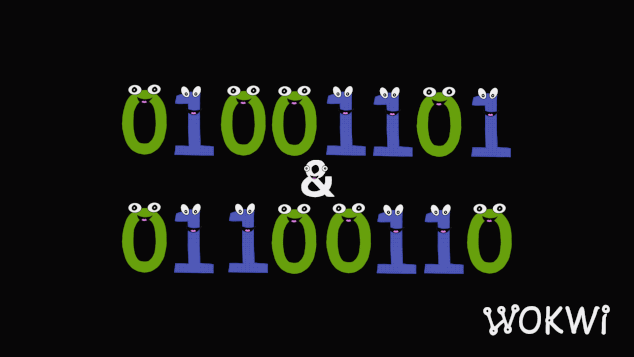
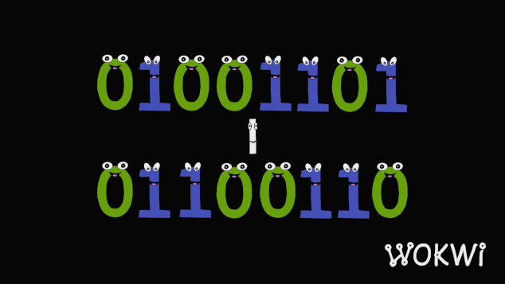
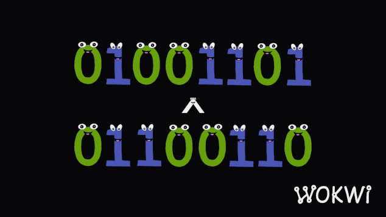
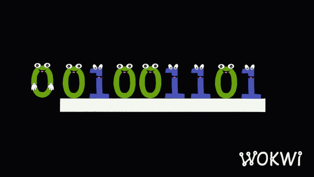

# C'ye Derleme Notlar

## Pointer

**Pointer'lar** verilerin bellekteki adreslerini saklamak, temsil etmek için kullanılan değişkenlerdir. Verilerin bellekte ki adreslerini saklayan bir _pointer_ aynı zaman da o verinin değerine de erişebilir. Bellekte bir verinin adresi ve değeri nasıl tutuluyorsa aynı şekilde _pointer_'ın da bellekte bir kendi adresi ve tuttuğu değer (yani _pointer_'a atanan değerin adresi) vardır. _Pointer_ kendisine atanan adrese (değere) her zaman işaret eder yani onu gösterir ancak onu değiştirene kadar. Bunlar _pointer_'ın tuttuğu adresin (değerinin) arttırılması, azaltılması, veya bambaşka bir adres atanması olabilir.

```c
int x = 10;
int *ptr = &x;
```

Daha iyi anlaşılması adına şu şekilde bir _pointer_ örneği gösterilebilir;

```c
#include <stdio.h>

int main()
{
  int x = 10;
  int *ptr = &x;
  
  printf("Pointer'in kendi adresi: %p\n", &ptr);
  printf("Pointer'in degeri: %p\n", ptr);
  printf("x degiskeninin adresi: %p\n", &x);
  printf("Tutulan degerin degeri: %d\n", *ptr);
  
  return 0;
}
```

Çıktı;

```
Pointer'in kendi adresi: 0xfff000ab8 // &ptr
Pointer'in degeri: 0xfff000ab3 // ptr
x degiskeninin adresi: 0xfff000ab3 // &x
Tutulan degerin degeri: 10 // *ptr
```

Bu durumda _pointer_'ların 3 farklı durumunu gördük;

```
&ptr --> Pointer'ın bellekte ki kendi adresi
ptr  --> Pointer'ın tuttuğu değer (yani x'in adresi)
*ptr --> Pointer'ın tuttuğu değerin değeri (yani 'x' o da '10')
```

Pointer'ın işaret ettiği değeri pointer aracılığıyla değiştirirsek o değeri tutan değişkende de değer değişecektir çünkü o pointer o değişkenin adresini tutuyor bu sayede (sanki kimliğini biliyormuş) değeri ile alakalı bir değişiklik yapması söz konusu oluyor;

```c
#include <stdio.h>

int main()
{
  int a = 10;
  int *p = &a;
  printf("%d\n", *p);
  *p = 20;
  printf("%d\n", a);
}

```

### Pointer'larda Postfix

Normal bir değeri **postfix** ifadelerini kullanarak arttırabildiğimiz gibi _pointer_'larda da bu ifadeleri kullanabiliriz. Ancak bu ifadeleri kullanırken işler karmaşıklaşabilir. Genel itibariyle şu şekilde ifade edilebilirler;

```
ptr++;     --> onu kullan ve sonraki int pozisyonuna geç
++ptr;     --> sonraki int'e geçin ve onu kullan
++*ptr;    --> ptr'nin değerinin değerini artır ve kullan
++(*ptr);  --> ptr'nin değerinin değerini artır ve kullan
++*(ptr);  --> ptr'nin değerinin değerini artır ve kullan
*ptr++;    --> ptr'nin değerinin değerini kullan ve bir sonra ki konuma geç
(*ptr)++;  --> ptr'nin değerinin değerini kullan ve kullanılan değeri artır
*(ptr)++;  --> ptr'nin değerinin değerini kullan ve bir sonra ki konuma geç
*++ptr;    --> bir sonra ki konuma geç ve ptr'nin değerinin değerini kullan
*(++ptr);  --> bir sonra ki konuma geç ve ptr'nin değerinin değerini kullan
```

İlk olarak, `++` operatörü `*` operatörüne göre önceliklidir ve `()` operatörleri diğer her şeye göre önceliklidir.  
  
İkinci olarak, `++sayı` operatörü, eğer onları herhangi bir şeye atamıyorsanız, `sayı++` operatörüyle aynıdır. Aradaki fark, `sayı++'nın` sayıyı döndürmesi ve ardından sayıyı artırması, `++sayı'nın` ise önce artırması ve sonra döndürmesidir.  
  
Üçüncüsü, bir _pointer'ın_ değerini artırarak onu içeriğinin boyutu kadar artırmış olursunuz, yani sanki bir dizide yineliyormuşsunuz gibi onu artırmış olursunuz.

### Pointer Comparisons

Değerlerin birbirlerinden büyük, küçük eşit veya eşit olmadığını karşılaştırabildiğimiz gibi _pointer_'ların tuttuğu değerleri (yani adresleri) de karşılaştırabiliriz.

```c
int a = 10;
int *p1;
int *p2;

p1 = &a;
p2 = &a;

if(p1 == p2)
 printf("İşaret edilen yer adresi aynı!");
else
 printf("İşaret edilen yer adresleri aynı değil!");
```

Pointer'ın gösterdiği adresin büyüklük veya küçüklüğü, o konumun bellekteki konumuna bağlıdır. Yani aslında derleyicinin ve işletim sisteminin nasıl bellek ayırdığına da bağlıdır. Bu yüzden bu materyallere bağlı olduğundan büyük veya küçük olduğu durumları değişebilir.

```c
#include <stdio.h>

int main()
{
  int x = 10;
  int a = 10;
  int *p1 = &x;
  int *p2 = &a;
  
  if(p1 > p2)
    printf("Büyük");
  else
    printf("Küçük");  
  return 0;
}
```

Ancak bu örnek de _**bellekten belirli bir adres alanı tahsis edildiği için bu alanın sınırları içerisinde kimin daha büyük veya küçük mukayesesi yapılabilir.**_ Bu da hangi adres daha ilerideyse o daha büyük olur anlamına geliyor. Yani sonuncu adres en büyükleri oluyor. Çünkü bu tahsis bellek tarafından ardışık olarak adreslendi.

```c
#include <stdio.h>
#include <stdlib.h>

int main()
{
  char *str;
  str = malloc(10);
  
  printf("%p\n", (str + 4));
  printf("%p\n", (str + 3));
  
  if((str + 4) > (str + 3))
    printf("Büyük");
  else
    printf("Küçük");
  return 0;
}
```
### Pointer ve Array

Array'de bir _pointer_ gibi düşünülebilir. Ancak aralarında bazı farklar bulunur. Bunlardan biri **Dinamik Bellek Tahsisi**'dir. Çünkü bir _array_'e eğer ki 10 adet bir yer tahsisinde bulunması söylenirse bu program boyunca ihtiyacı karşılayamayabilir. Bu yüzden bu konuda yardıma _pointer_'lar koşar. **Dinamik bellek tahsisi**, _pointer_'lar ile birlikte programın ihtiyaç duyduğu bellek miktarını kontrol etmemize olanak tanır. _Pointer'lar_, programın çalışma süresi boyunca bellekte tahsis edilebilir,  yeniden tahsis edilebilir ve silinebilir.

Birbirlerine benzemesinin sebebi ise _array_'ler tanımlandığında bellekte ardışık olarak yer tahsis eder ve _array_ bu ardışık setin ilk adresini tutar. Bu yüzden de bir _array_'i bir _pointer_'a atarken normal bir değişkenlerde atama yapılırken kullanılan referans (&) işaretini kullanmayız. _Array_'ın ismi _array_'in ilk elemanının adresini temsil eder.

```c
int numbers[5];
int num = 7;

int *ptr = numbers; // Dizi adını işaretçiye atar, "&" kullanmamız gerekmez. Yani ptr = &numbers[0] oluyor.
int *ptr2 = &num;
```

Normal bir değişken, tek bir değeri temsil eder. Örneğin, `int num = 7;` ifadesinde `num`, bellekte 7 değerini tutar. Normal bir değişkenin adresine ayrıyeten erişmek isterseniz, `&` operatörünü kullanmanız gerekir.

#### Çok boyutlu Pointer ve Array

Çok boyutlu pointer veya array'i veri kümeleri olarak düşünebiliriz. Bunu şu şekilde ele almak isterim; 

Sadece bir harfi depolamak için `char` tipi bize yetiyor. Ancak o harflerden oluşan bir kelime içinse bir `char*` pointer veya `char[]` array'i kullanmamız gerekiyor. Ve bu kelimelerden oluşan bir cümle için `char**` pointer veya `char[][]` çift boyutlu bir array gerekiyor. Bu cümleleri ise bir metin gibi saklamak istersek ise yine bunun bir üst seviyesi `char***` pointer veya `char[][][]` boyutlu bir veri kümesine ihtiyaç duyabiliriz.

Aslında hepsinin üst seviyesi bir alt seviyesinin ilk elemanı oluyor böylece bir bütün oluşturulabiliyor.

Şayet bu cümleyi atomlarına ayırırsak: _"deneme bir iki üç"_;

```
char    --> 'd'
char*   --> "deneme"
char**  --> "deneme", "bir", "iki", "üç"
char*** --> {"deneme", "bir", "iki", "üç"}, {...}
```

gibi düşünülebilir.

```c
#include <stdio.h>

int main() 
{
    char *strs[] = {"deneme", "bir", "iki", "uc", NULL}; // 2D Pointer
    char *str = *strs;
    char ***strss = strs;
    char c = **strss;
    
    printf("%c\n", c);
    return 0;
}
```

Yukarıda ki örnekte `char *strs[]` satırında çift boyutlu bir **pointer array** tanımlaması yapılıyor. Bu çift boyutlu array tanımlamasının `char**` bu şekliyle tanımlanmamasının sebebi yukarıda ki örneğin satır sayısı bakımından uzayacağındandır. Pointer array kullanarak değer ataması daha tanımlanırken atanabildiğinden fazla satırlardan kurtulunmuş olunuyor. Ancak bu yönteminde bir bedeli tanımlama yaparken değer ataması yapılması gerekliliğidir. Bilakis program derlenemez. Sebebi eğer `char *arr[];` yazarsan **ve boyut belirtmezsen** (`[]`) ama değer de vermezsen, derleyici **kaç elemanlık dizi ayıracağını** bilemez ve bu syntax hatası olur. Bir **dizi** tanımladığında, C derleyicisi o dizinin **kaç elemandan oluşacağını** bilmek zorunda.

>[!TIP]
> `char *arr[]` pointer array'ine atama yaparken ayarlanan değerlerin sonunda `NULL` sentinel değerinin verilmesi tavsiye edilir. Şayet bu dizinin içeriği ile ilgili bir işlem yapılacaksa (örnek olarak döngülerde) hatalara sebebiyet verebilir.

```c
char *arr[] = {"elma", "armut", NULL};  // ✅ boyut 2, derleyici biliyor
char *arr[5];                     // ✅ boyut 5, elemanlar şu an NULL olabilir
char *arr[];                      // ❌ HATA: boyut belirsiz
```

`char **ptr;` dediğinde boyut diye bir zorunluluk yok, çünkü bu sadece **tek bir pointer değişkeni**:

```c
char **ptr;  // şu an sadece pointer var, henüz nereye baktığı belli değil
```

Sonradan istediğin adrese yönlendirebilirsin:

```c
char *arr[] = {"elma", "armut", NULL};
ptr = arr; // ✅
```

Ya da dinamik olarak ayırabilirsin:

```c
ptr = malloc(sizeof(char*) * 10); // 10 pointerlık yer
```
#### Pointer Aritmetiği

Pointer'larda bir indeksi göstermeye çalışırken array ifadesi kullanabiliriz veya **pointer aritmetiği** özelliği ile bazı işlemlerin aynısını ve fazlasını daha iyi uygulayabiliriz.

```c
#include <stdio.h>

int main() 
{
    char str[6] = "deneme";
    ++str; // lvalue gerekli artırma işlemi için
    return 0;
}
```

Gibi bir örnekte array'lerin başlangıç adresleri hareket ettirilemez. Buna bir `lvalue` gerekli olduğu belirtilir. Bu yüzden bunun aynısının bir de pointer versiyonunu yazarsak şayet bu problemi çözmüş olacağız. Çünkü pointer'lar ile rahatlıkla gezinebiliriz.

```c
#include <stdio.h>

int main() 
{
    char* str = "deneme";
    
    str++;
    printf("%c\n", str[0]);
    return 0;
}
```

Burada pointer'ın işaret ettiği adres `d` 'dir. Ancak `str++` ifadesi ile işaret ettiği yeri `e` harfine yönlendiriyoruz. Bu yüzden `str` pointer'ın ilk elemanı artık `e` oluyor. Bu yüzden `str[0]` ifadesi `d` yerine artık `e` olmuş oluyor.

Ancak `d` tamamen kaybedilmiş olmuyor;

```c
#include <stdio.h>

int main() 
{
    char* str = "deneme";
    ++str;
    printf("%c\n", *str);
    str--;
    printf("%c\n", *str);
    return 0;
}
```

Fark edildiği üzere `str--` ifadesini kullanarak tekrardan `d`'ye geri dönebildik. Burada ki `str[0]` yerine kullanılan `*str` ifadesi pointer'ın işaret ettiği adresin değerini belirtir. Bu ifade sayesinde direkt olarak işaret edilen adresin değerine ulaşabiliriz. Yukarıda [[C#Pointer'larda Postfix|Pointer'larda Postfix]] konusun da bahsedilen şeylerde bir nevi **Pointer aritmetiği**'dir.

```c
char* str = "deneme";

*(str + 2) // bize 'n' harfini verir
```

Bu tarz ifadeler ile (sanki array ifadeleri gibi) değerlere ulaşabiliriz.

```c
#include <stdio.h>

int main() 
{
    char* str = "deneme";
    
    str += 2;
    printf("%c\n", *str);
    return 0;
}
```

Yine bu örnekte de pointer'ın işaret ettiği konumu 2 konum ilerlettik. Bu tarz ifadeler ile bir pointer alanında istenilen şekilde gezilebilir.

### Pointer Deklarasyon Biçimi

C dilinde değişken tanımlarken `*` işareti **türe değil, değişken ismine bağlanır**.

```c
int* p1, p2;
```

Bu satırda sadece **p1** bir _pointer to int_ (int’e işaretçi) olarak tanımlanıyor, **p2** ise normal bir `int` olarak tanımlanıyor, **işaretçi değil**.

Yani:
- `p1` → `int*`
- `p2` → `int`

Her iki değişken de pointer olarak belirlenecek ise şu şekilde bir deklarasyon yapılması gerekli;

```c
int *p1, *p2;
```

>[!TIP]
> `*` her zaman yanındaki değişkenle birlikte değerlendirilir, tüm satıra otomatik yayılmaz. Bu yüzden değişken tanımlamalarında `*` işaretini türe değil değişkenin ismine yapışık biçimde yapılması kafa karışıklığını önleyebilir.

Farklı deklarasyon biçimlerine örnek;

**Pointer + Array karşımı:**

```c
int* arr[5];
```
5 elemanlı **int pointer** dizisi demek.

Ancak:
```c
int (*arr)[5];
```
**5 elemanlı int dizisine işaretçi** ile karıştırılmamalı.

**Fonksiyon Pointer:**
```c
int* func();   // int pointer döndüren fonksiyon
int (*func)(); // int döndüren fonksiyona pointer
```

### Fonksiyon Pointer

**Fonksiyon işaretçileri**, fonksiyonları işaret eden pointer'lardır ve programın çalışma zamanında (Runtime) fonksiyonları dinamik olarak değiştirmenizi veya seçmenizi sağlar.

```c
#include <stdio.h>

int topla(int x, int y) 
{
    return x + y;
}

int carp(int x, int y) 
{
    return x * y;
}

int main() 
{
    int (*hesapla)(int, int); // İşlev işaretçisi tanımı

    hesapla = topla; // İşaretçiyi 'topla' işlevine ayarla
    printf("Toplam: %d\n", hesapla(5, 3)); // 'topla' işlemini çağır

    hesapla = carp; // İşaretçiyi 'carp' işlevine ayarla
    printf("Carpim: %d\n", hesapla(5, 3)); // 'carp' işlemini çağır

    return 0;
}
```

Birden çok fonksiyona işaret edilmek istenirse (bir pointer fonksiyonunun fonksiyonları depolanması istenirse) şayet;

```c
#include <stdio.h>

int topla(int x, int y) 
{
    return x + y;
}

int carp(int x, int y) 
{
    return x * y;
}

int bol(int x, int y) {
    if (y != 0)
        return x / y;
    else
        return 0;
}

int main() {
    int (*hesapla[])(int, int) = {topla, carp, bol}; // İşlev işaretçileri dizisi

    printf("Toplam: %d\n", hesapla[0](5, 3)); // 'topla' işlemini çağır
    printf("Carpim: %d\n", hesapla[1](5, 3)); // 'carp' işlemini çağır
    printf("Bolum: %d\n", hesapla[2](10, 2)); // 'bol' işlemini çağır

    return 0;
}
```


---
## Call by Reference-Value

Bir değişkeni argüman olarak bir fonksiyona verdiğimizde fonksiyon prototipine göre işler değişebilir. 

Örneğin bir değişkene `99` değerini atayan bir fonksiyon yazıldığını düşünürsek, karesi hesaplanması istenen değişkeni parametre olarak alıp bu işlemi yapıp değişkene geri döndürdüğünü düşünelim;
### Call by Value 

```c
#include <stdio.h>

int defineandsquare(int num)
{
  num = 99;
  num *= num;
  return num;
}

int main()
{
   int number = 5;
   number = defineandsquare(number);
   printf("%d\n", number);
   return(0);
}
```

Bu örneğin arkaplanında olanlar şu şekildedir; Öncelikle `number` adında bir `int` değişkeni oluşturulur ve bu değişken `defineandsquare` adlı fonksiyona gönderilir. Bu fonksiyonun parametresi olan `num` aldığı değer `5` olduğundan aynen bu şekilde belleğe, aldığı değerle birlikte kopyalar ve kendisini kendisiyle çarpıp döndürür ve kendisini bellekten siler. 

İşte buna **Call by Value** denir. Fonksiyon aldığı değerin aynısını bellekte kopyalar ve fonksiyon bitiminde siler.

Peki, fonksiyon içerisinde sadece bu atamayı yapmış olsaydık ve değer `return` edilmeseydi şayet yine `number` değişkeni `99` olacak mı? 

```c
#include <stdio.h>

void define(int num)
{
  num = 99;
}

int main()
{
   int number = 5;
   define(number);
   printf("%d\n", number);
   return(0);
}
```

Bu durumda `99` olan değer sadece `num` değişkeni olacaktır. Çünkü bellekte `number` değişkeninin ilk başta değerini kopyalayacak ve ardından fonksiyonun içerisinde bu değere `99` değeri atanacak ve fonksiyon bitiminde de bu değer bellekten silinecektir.

Bu durumda `number` değişkenini direkt olarak nasıl değiştirebiliriz?
### Call by Reference

```c
#include <stdio.h>

void define(int* num)
{
  *num = 99;
}

int main()
{
   int number = 5;
   define(&number);
   printf("%d\n", number);
   return(0);
}
```

Bir pointer aracılığıyla `number` değişkeninin değerini değiştirebiliriz. Bu sayede `number` değişkeninin değeri bellekte kopyalanmaz ve değere _pointer_ aracılığı ile erişip bir değişiklik yapabiliriz. Bu işleme de **Call by Reference** denir.


---

## Variadic Fonksiyon

Bir fonksiyonun sınırsız şekilde argüman alması istenirse **variadic fonksiyon** bu duruma çözüm sunabilir.

```c
#include <stdio.h>
#include <stdarg.h> // variadic yapılar için gerekli kitaplık

int sum(int count, ...) 
{
  int sum = 0;
  va_list ap;
  va_start(ap, count);
  for (int i = 0; i < count; i++)
    sum += va_arg(ap, int);
  va_end(ap);
  return sum;
}

int main()
{
  int result = sum(3, 1, 2, 3);
  printf("%d\n", result);
  return 0;
}
```

`...` ifadesinden önce mutlaka bağımsız bir parametreye (değişkene) ihtiyaç duyulur. Bu parametre girilecek olan argüman sayısı olabilir. Veya birden fazla bağımsız parametre de oluşturulabilir.  
  
```c
#include <stdio.h>
#include <stdarg.h> // variadic yapılar için gerekli kitaplık

int sum(int add, int c, ...) 
{
  int sum = 0;
  va_list ap;
  va_start(ap, c);
  for (int i = 0; i < c; i++)
    sum += va_arg(ap, int);
  va_end(ap);
  return sum + add;
}

int main()
{
  int result = sum(99, 3, 1, 2, 3);
  printf("%d\n", result);
  return 0;
}

```

C dilinde, _variadic fonksiyonları_ işlemek için `va_...` yapıları kullanılır bu yapılara `<stdarg.h>` kitaplığı ile erişilebilir;

`va_list`:
- `va_list` değişken sayıda argümanları saklamak için kullanılan bir veri türüdür.
- Genellikle bir fonksiyonun içinde, değişken sayıda argümanları bu veri türü ile tutarsınız.

`va_start`:
- `va_start` işlevi, `va_list` ile tutulan argüman listesini başlatır ve ilgili fonksiyona gönderilen ilk argümanın adresini belirtir.

`va_arg`:
- `va_arg` işlevi, `va_list` ile tutulan argüman listesinden bir sonraki argümanı alır ve belirtilen türde bir değere dönüştürür.
- Her `va_arg` çağrısı, argüman listesinde bir sonraki argümana geçer.
- `va_arg` işleminin ikinci parametresi, `va_list` ile tutulan argüman listesinden alınacak argümanın veri türünü belirtir. Yani bu parametre, `va_arg` işleminin argümanın hangi türde olduğunu bilmesi için kullanılır.

`va_end`:
-  `va_end` işlevi, `va_list` ile tutulan argüman listesini işlemenin sonlandığını bildirir.


---


## Keyword'ler

### Sizeof

`sizeof` keyword'u, bir değişkenin veya ifadenin bellek kullanımını ölçmek için kullanılır. `sizeof`, bir değişkenin veya ifadenin boyutunu **byte** cinsinden döndürür.

Bu keyword genellikle `malloc()` fonksiyonunda bellekten tahsis edilmek istenen veri türünün bellekte kapladığı yer kadardır. Bunlar işletim sisteminin mimarisi (64 bit, 32 bit) veya programın çalıştığı ortama bağlı olabilir bu yüzden `sizeof` keyword'u bunun için kullanılabilir.

```c
int* p = (int*)malloc(sizeof(int)*20);
```

Burada ki ifade de `p` değişkenine `malloc()` fonksiyonu aracılığıyla bellekte kapladığı `int` türü ve çarpı 20 kadarlık bir yer tahsisinde bulunulmuştur.
### Goto ve Labels

`goto` keyword'ü ve `labels`, bir programın kontrol akışını değiştirerek, programın farklı bölümlerine atlamayı sağlar.
#### Goto

`goto` keyword'ü, bir programın kontrol akışını, bir `label`'e atlamayı sağlar.
#### Labels

`label` bir programın herhangi bir yerinde tanımlanabilir. Bu sayede `goto` keyword'üne o `label` verilebilir.

```c
int main() 
{
  int a = 10;
  // "start" label'ine atla
  goto start; // goto keyword'u
  printf("Bu kod asla yürütülmeyecek.\n");
start: // "start" label'i
  printf("a değişkeninin değeri: %d\n", a);
  return 0;
}
```

### Break

`break` ifadesi kullanıldığı yerde bulunan döngüyü veya anahtarlamayı (switch-case)
hemen sonlandırır ve programın akışını bir sonraki satırdan veya uygun olan bir yerden devam ettirir.

```c
#include <stdio.h>

int main() 
{
// Döngüler
    int i;
    for (i = 0; i < 5; i++)
    {
        if (i == 3)
            break; // Döngüyü sonlandırır
        printf("%d\n", i);
    }

// Anahtarlamalar (switch-case)
    int choice = 2;
    switch (choice) 
    {
        case 1:
            printf("Birinci durum\n");
            break;
        case 2:
            printf("İkinci durum\n");
            break;
        default:
            printf("Varsayılan durum\n");
            break;
    }
    return 0;
}
```

>[!WARNING]
> İç içe döngülerde `break` hangi döngü bloğu içinde kullanıldıysa sadece o döngüyü sonlandırır.

```c
#include <stdio.h>

int main() {
    int n1, n2;
    n1 = 10;
    n2 = 5;
    for (int i = 0; i < n1; i++) 
    {
        for (int j = 0; j < num2; j++)
        {
            if (j >= 2)
                break;
            printf("j: %d\n", j);
        }
        printf("i: %d\n", i);    
    }   
    return 0;
}
```

Burada ki iç içe döngüde `break` en içte ki döngü bloğunda kullanıldığından sadece o döngüye etki etmiş oldu. Onun üstünde ki döngü şartına bağlı şekilde `break`'ten etkilenmeden dönmeye devam etti.
### Continue

`continue` genel olarak döngülerde kullanılır. Bu sayede çalıştığı yerde bulunan döngünün mevcut iterasyonunu sonlandırır ve bir sonraki iterasyona geçer. Başka bir deyişle, `continue` ifadesi, döngü içindeki kodun geri kalanını atlayarak döngüyü devam ettirir.

```c
int main()
{
  for (int i = 0; i < 10; i++)
  {
    if (i % 2 == 0)
      continue;
    printf("i: %d\n", i);
  }
  return 0;
}
```


### Static

`static`, farklı bağlamlarda farklı anlamlara gelebilen bir anahtar kelimedir. İşte `static` keyword'ünün farklı kullanım alanları ve anlamları:
#### Static Değişken

`static` değişkenler, bir fonksiyon içinde tanımlandıklarında ve `static` anahtar kelimesi ile işaretlendiklerinde, normal yerel (local) değişkenlerden farklı özelliklere sahip olurlar:

1. **Ömür (Lifetime):** `static` değişkenler, programın başlangıcından programın sonuna kadar bellekte kalır. Yani, bir fonksiyon çağrısı sona erdiğinde dahi bellekte saklanmaya devam ederler.
2. **Görünürlük (Visibility):** `static` değişkenler, sadece tanımlandıkları fonksiyon içinde görünürlerdir. Başka fonksiyonlardan veya dosyalardan erişilemezler. Bu nedenle, tanımlandıkları fonksiyonun dışında kullanılamazlar.
3. **İlk Değer Atama:** `static` değişkenler, program başladığında otomatik olarak sıfırlanır veya başlangıç değeri ile başlatılırlar. Bu, her fonksiyon çağrısında değişkenin ilk değerini yeniden atamanıza gerek olmadığı anlamına gelir.

```c
#include <stdio.h>

void exampleFunction() 
{
    static int count = 0;
    count++;
    printf("Count: %d\n", count);
}

int main() 
{
    exampleFunction(); // Count: 1
    exampleFunction(); // Count: 2
    exampleFunction(); // Count: 3
    return 0;
}
```


#### Static Fonksiyon

Bir fonksiyonu `static` olarak işaretlediğinizde, bu fonksiyonun görünürlüğü sadece aynı kaynak dosyası içinde sınırlı olur. Yani, başka kaynak dosyalarından erişilemez. Bu, fonksiyonun yalnızca tanımlandığı kaynak dosyasında kullanılmasını sağlar ve diğer kaynak dosyalarının kütüphanelerini kirletmeden özel yardımcı işlevler oluşturmanıza olanak tanır.

```c
// main.c

#include <stdio.h>
static void localFunction() 
{
    printf("Bu fonksiyon yalnızca main.c içinden erişilebilir.\n");
}

int main() 
{
    localFunction();
    return 0;
}
```

### Void

`void`, genellikle fonksiyonların dönüş türünü belirtmek için kullanılır:

```c
void helloWorld()
{
    printf("Merhaba, Dünya!\n");
}
```

Veya `return;` olarak da bir kullanım olabilir:

```c
void helloWorld()
{
    printf("Merhaba, Dünya!\n");
    return;
}
```

Genel olarak fonksiyonun ne döndüreceğini ifade etmek için kullanılsa da pointer'lar ile birlikte de kullanılabilir. Kullanımında pointer'ın herhangi bir veri türüne işaret edebileceğini ifade eder. Kısaca **herhangi bir veri türüne işaret edebilen** bir işaretçiyi temsil eder.

```c
int intValue = 42;
float floatValue = 3.14;

void* genericPtr;

genericPtr = &intValue; // int türünden bir işaretçi
printf("int: %d\n", *(int*)genericPtr);

genericPtr = &floatValue; // float türünden bir işaretçi
printf("float: %.2f\n", *(float*)genericPtr);
```

>[!WARNING]
> Bu işaretçiyi kullanırken, işaret ettiği veri türünü bilmeniz ve ona göre bir tip dönüşümü yapmanız gerekebilir.

`void*` işaretçiler, özellikle fonksiyonlara veri türü bağımsız verileri iletmek veya işlemek için kullanılır. Fonksiyon parametrelerinde `void*` kullanılarak farklı veri türlerinden veriler işlenebilir.

```c
#include <stdio.h>

void printValue(void* data, char dataType) 
{
    if (dataType == 'i')
        printf("int: %d\n", *(int*)data);
    else if (dataType == 'f')
        printf("float: %.2f\n", *(float*)data);
    else if (dataType == 's')
	    printf("string: %s\n", (char*)data);
    else
        printf("Bilinmeyen veri türü\n");
}

int main() 
{
    int intValue = 42;
    float floatValue = 3.14;
    char stringValue[] = "Hello, World!";

    printValue(&intValue, 'i');
    printValue(&floatValue, 'f');
    printValue(stringValue, 's');

    return 0;
}
```

### Extern

`extern`, değişkenlerin veya fonksiyonların başka bir kaynak dosyasından erişilebilir olduğunu belirtmek için kullanılır. `extern` anahtar kelimesi, programın farklı kaynak dosyaları arasında veri ve işlevlerin paylaşılmasını sağlar. 

Genel olarak _global değişkenler_ de kullanılır;

```c
// main.c

#include <stdio.h>

extern int sharedValue;
int main() 
{
    printf("sharedValue: %d\n", sharedValue);
    return 0;
}
```

```c
// other.c

int sharedValue = 42; // sharedValue değişkeninin tanımı
```

Ancak fonksiyonlarla da bir kullanım olabilir. Fonksiyonların tanımlarını farklı kaynak dosyalarında gerçekleştirdiğinizde ve bu fonksiyonlara diğer kaynak dosyalarından erişmek istiyorsanız, fonksiyon tanımının başına `extern` anahtar kelimesini eklemeniz gerekir.

```c
// main.c

#include <stdio.h>

extern void sharedFunction(); // sharedFunction fonksiyonu başka bir kaynak dosyada tanımlanmıştır

int main() 
{
    sharedFunction(); // sharedFunction fonksiyonunu çağırır
    return 0;
}
```

```c
// other.c

#include <stdio.h>

void sharedFunction()
{
    printf("Bu fonksiyon başka bir kaynak dosyadan çağrıldı.\n");
}
```


### Typedef

`typedef`, yeni bir veri türünün (data type) isimlendirilmesini veya özelleştirilmiş bir veri türünün ayarlanmasını sağlar. `typedef` anahtar kelimesi, kodun daha anlaşılır ve okunabilir olmasına yardımcı olur ve veri türlerini yeniden kullanılabilir kılar.

`typedef` kelimesinin kullanım prototipi genel olarak şu şekildedir;

```c
typedef eski_veri_turu YeniVeriTuru;
```

1. **Mevcut Veri Tipi Ayarlamaları**
`typedef` ile mevcut bir veri türüne yeni bir isim ayarlanabilir;

```c
typedef int Tamsayi; // int veri türüne "Tamsayi" adını ayarlar

Tamsayi x = 42;
```


2. **Pointer Ayarlamaları**
`typedef` ile işaretçileri tanımlayarak daha okunabilir ve anlaşılır kodlar oluşturabilirsiniz;

```c
typedef int* TamsayiIsaretcisi; // int işaretçisine "TamsayiIsaretcisi" adını ayarlar

int a = 42;
TamsayiIsaretcisi ptr = &a;
```

3. **Struct Ayarlamaları**
`typedef` ile yapılar tanımlanabilir ve bu yapılar daha sonra kullanılmak üzere yeniden adlandırılabilir;

```c
typedef struct 
{
    int x;
    int y;
} Nokta; // Struct'a "Nokta" adını ayarlar

Nokta p1;
p1.x = 3;
p1.y = 5;
```

```c
typedef struct s_list
{
	void			*content;
	struct s_list	*next;
}					t_list; // Struct'a "t_list" adını ayarlar
```


---


## Data Structures

**Structs**, **Enums**, ve **Unions** gibi yapılar, verileri farklı şekillerde organize etmek ve depolamak için kullanılan yapısal elemanlardır. Bu yapılar, programın verileri daha düzenli ve etkili bir şekilde yönetmesine yardımcı olur.
### Structs

**Struct**, farklı veri türlerini tek bir veri yapısı içinde gruplamak için kullanılan bir yapıdır. Bu yapı, birçok farklı veriyi bir araya getirerek daha karmaşık veri yapıları oluşturmanıza olanak tanır. Struct'lar, programlarda verileri düzenli bir şekilde saklamak ve işlemek için oldukça kullanışlıdır.

Bir struct tanımlandığında, içinde farklı veri türlerine sahip veri elemanları (fields veya members) bulunur. Her bir veri elemanı, struct içinde bir isimle ve veri türü ile tanımlanır;

```c
#include <stdio.h>

struct Ogrenci 
{
    char ad[50];
    int numara;
    float notlar[3];
};

int main() 
{
    // Ogrenci struct'ından bir nesne (instance) oluşturma
    struct Ogrenci ogrenci1;

    // Veri elemanlarına değer atama
    strcpy(ogrenci1.ad, "Ahmet Yilmaz");
    ogrenci1.numara = 12345;
    ogrenci1.notlar[0] = 90.5;
    ogrenci1.notlar[1] = 85.0;
    ogrenci1.notlar[2] = 78.5;

    // Veri elemanlarına erişim
    printf("Ad: %s\n", ogrenci1.ad);
    printf("Numara: %d\n", ogrenci1.numara);
    printf("Notlar: %.2f, %.2f, %.2f\n",
           ogrenci1.notlar[0], ogrenci1.notlar[1], ogrenci1.notlar[2],
           ogrenci1.notlar[3], ogrenci1.notlar[4]);

    return 0;
}
```

>[!NOTE]
> Yukarıda ki örnekte `main()` fonksiyonun da `Ogrencı` struct'ından bir nesne (instance) veya birden fazla nesne oluştururken sürekli `struct Ogrenci` yazmamak için struct'a [[C#Typedef|Typedef]] ile etiket (label) verilebilir. 

#### Linked List

**Linked List**, birbirine bağlı elemanlardan oluşan bir veri yapısıdır. Her eleman, kendinden önceki ve kendinden sonraki elemanın adresini tutar. Bu sayede, elemanlar bir zincir gibi birbirine bağlanır.

_Linked List'in_ temel özellikleri şunlardır;

1. **Bağlı Elemanlar:** Bir linked list, düğümler (nodes) olarak adlandırılan elemanların birbirine bağlandığı bir veri yapısıdır. Her düğüm, veri ve bir sonraki düğümün referansını içerir.
2. **Dinamik Boyut:** Linked List, elemanlar ekledikçe veya çıkardıkça dinamik olarak büyüyebilir veya küçülebilir. Bu, bellek kullanımını daha verimli hale getirir.
3. **Bağlantılı Elemanlar:** Her düğümün bir sonraki düğüme işaret ettiği bir bağlantı vardır. Bu bağlantılar sayesinde, linked list boyunca dolaşmak mümkün olur.
4. **Çeşitli Türleri:** İki ana türü vardır: tek yönlü linked list (sadece ileri yönde dolaşılabilir) ve çift yönlü linked list (hem ileri hem de geri yönde dolaşılabilir).
5. **Baş ve Son Düğümler:** Linked List'in başı ve sonu, listenin başlangıcını ve sonunu işaretleyen özel düğümlerdir. Bu baş ve son düğümler, listeye eleman eklerken veya çıkartırken işlemi kolaylaştırır.


```c
#include <stdio.h>
#include <stdlib.h>

// Tek yönlü linked list düğümü
struct Node 
{
    int data;
    struct Node* next;
};

int main() 
{
    // Linked List başlangıcı
    struct Node* baslangic = NULL;

    // Düğümler oluşturma ve veri ekleme
    for (int i = 1; i <= 5; i++) 
    {
        struct Node* yeniDugum = (struct Node*)malloc(sizeof(struct Node));
        yeniDugum->data = i;
        yeniDugum->next = baslangic; // Yeni düğümü liste başına ekler.
        baslangic = yeniDugum; // Yeni düğümü liste başı yapar.
    }

    // Linked List'i dolaşma ve verileri yazdırma
    struct Node* current = baslangic;
    while (current != NULL) 
    {
        printf("%d -> ", current->data);
        current = current->next;
    }
    printf("NULL\n");
    return 0;
}
```

>[!NOTE]
> Bu ve buna benzer veri yapılarının oluşturulma amacı veriyi saklamanın, erişebilirliğin ve buna benzer yöntemlerin daha kolay olmasını sağlamaktır. Bu yüzden buna benzer yine veri yapıları vardır (**Binary Tree**, **Red Black Tree**, **Stack**, **Queue**, vb.). 

### Enums

**Enum (Enumeration)**, belirli sabit değerleri sembolik isimlerle temsil etmek için kullanılan bir veri türüdür.

**Enums**, temelde belirli bir sıraya sahip tamsayı değerlerini sembolik isimlerle temsil eden bir yapıdır. İlk eleman, (spesifik olarak bir atama yapılmadıysa) varsayılan olarak 0'dan başlayarak artar ve her bir sonraki eleman bir öncekini bir birim artırır. Ancak, _enum_ elemanlarına özel değerler atayabilirsiniz.

```c
enum Renk {
    KIRMIZI,  // 0
    YESIL,    // 1
    MAVI,     // 2
    SARI      // 3
};
```

Varsayılan olarak, "KIRMIZI" 0, "YESIL" 1, "MAVI" 2 ve "SARI" 3 değerlerine sahiptir. Yani, bu enum değerleri birer sayı olarak temsil edilir.

Ancak, enum elemanlarına özel değerler atayabilirsiniz. Örneğin;

```c
enum Renk {
    KIRMIZI = 1,
    YESIL = 2,
    MAVI = 4,
    SARI = 8
};
```

1. **Sembolik İsimler:** Enums, belirli değerleri daha anlaşılır ve okunabilir hale getirmek için sembolik isimlerle ilişkilendirir. Bu, kodun daha anlaşılır ve bakımının daha kolay olmasını sağlar.
2. **Sıralı Değerler:** Enum elemanları genellikle sıralıdır, yani her bir eleman önceki elemanın bir sonraki değerini bir birim artırır. Ancak, _enum_ elemanları belirli bir değerle başlatılabilir ve ardışık olmak zorunda değildir.
3. **Varsayılan Veri Türü:** Enum elemanları, genellikle `int` veri türüne sahiptir, ancak belirli bir tamsayı veri türü de atanabilir.

```c
#include <stdio.h>

// Bir enum tanımı
enum Renk 
{
    KIRMIZI,
    YESIL,
    MAVI,
    SARI
};

int main() 
{
    // Enum değerlerini kullanma
    enum Renk secilenRenk = YESIL;

    // Enum değerini yazdırma
    printf("Secilen renk: %d\n", secilenRenk);

    // Switch kullanarak enum değerini işleme
    switch (secilenRenk) 
    {
        case KIRMIZI:
            printf("Kirmizi renk secildi.\n");
            break;
        case YESIL:
            printf("Yesil renk secildi.\n");
            break;
        case MAVI:
            printf("Mavi renk secildi.\n");
            break;
        case SARI:
            printf("Sari renk secildi.\n");
            break;
        default:
            printf("Bilinmeyen renk secildi.\n");
            break;
    }
    return 0;
}
```

### Unions

**Union**, farklı veri tiplerini aynı bellek alanında saklamak için kullanılan bir veri yapısıdır. Unions, Struct'lar gibi, birden fazla veri elemanını bir araya getirir, ancak bu elemanlar aynı bellek alanını paylaşır ve aynı anda sadece bir elemana erişim sağlar.

```c
#include <stdio.h>

union VeriUnion 
{
    int tamSayi;
    float ondalikSayi;
    char* isim;
};

int main() 
{
    union VeriUnion veri;

    // Tam sayı elemanını kullanıyoruz
    veri.tamSayi = 42;
    printf("Tam Sayi: %d\n", veri.tamSayi);

    // Şimdi, aynı bellek alanında ondalık sayı elemanını kullanmaya çalışırsak:
    veri.ondalikSayi = 3.14;
    printf("Ondalik Sayi: %.2f\n", veri.ondalikSayi);
    
    veri.isim = "Ali";
    // Şimdi tekrar tam sayı elemanını kullanmaya çalışırsak:
    printf("Tam Sayi: %d\n", veri.tamSayi);
    printf("Ondalik Sayi: %.2f\n", veri.ondalikSayi);
    printf("Isim: %s\n", veri.isim);

    return 0;
}
```

Burada dikkat edilmesi gereken nokta **Unions**'larda birbirinden farklı veri elemanlarının bellek kullanımı aynı alan üzerinden olduğundan içerisinde bulunan veri elemanına her bir değer ataması yapıldıktan önce ki veri elemanının değerinin kaybolmasıdır. 

Burada ki örnekte ilk başta `tamSayi` elemanına bir atama yapıp değerini ekrana yazdırabiliyoruz ancak sonra ki satırlarda `ondalikSayi` elemanına bir değer ataması yapılınca `tamSayi` elemanının değeri kaybediliyor. Ve daha da sonrasında `isim` elemanına ardından gelen bir değer ataması yapılınca da bu sefer de `ondalikSayi` elemanı değerini kaybediyor bunun sebebi _**Union'ların Struct'larda ki gibi veri elemanları için ayrı ayrı bir bellek alanı oluşturmamalarıdır. Hepsi aynı bellek alanını paylaştıklarından her birine değer ataması yapılsa da en son değer ataması yapılan veri elemanı güncel değer olmuş oluyor.**_

---

## Binary - Bitwise 
### Bitwise Operators

Her bir değerin bilgisayar tarafında bit düzeyinde (0 ve 1'lerden oluşan) bir karışığı vardır. **Bitwise Operators**, bilgisayarın belleğindeki veya bir veri türündeki herhangi bir belirli biti işlemek veya manipüle etmek için kullanılan operatörlerdir. Bu operatörler, özellikle düşük seviyeli veri manipülasyonu ve işlem yaparken kullanışlıdır. 

Kısaca bu değerlerin 0 ve 1 değerlerinden oluşan bit setlerini bozmak, oynamak, sağa veya sola kaydırmak, az sonra değinilecek olan operatör kapıları ile bu setleri mukayeseye sokarak bit düzeyinde işlemler yapmaktır.


1. **AND Operatörü (&):** `&` operatörü, iki bit dizisi arasında "ve" mantıksal işlemi yapar. Her iki bit de 1 ise sonuç 1, diğer durumlarda sonuç 0 olur.
```c
unsigned int a = 12;  // 01100
unsigned int b = 25;  // 11001

unsigned int sonuc = a & b;  // 8 (01000)

/*
 01100 --> 12
 11001 --> 25
&_____
 01000 --> 8
*/
```



2. **OR Operatörü (|):** `|` operatörü, iki bit dizisi arasında "veya" mantıksal işlemi yapar. En az bir bit 1 ise sonuç 1, diğer durumlarda sonuç 0 olur.
```c
unsigned int a = 12;  // 01100
unsigned int b = 25;  // 11001

unsigned int sonuc = a | b;  // 29 (11101)

/*
 01100 --> 12
 11001 --> 25
|_____
 11101 --> 29
*/
```



3. **XOR Operatörü (^):** `^` operatörü, iki bit dizisi arasında "özel veya" mantıksal işlemi yapar. İki bit aynı ise sonuç 0, farklı ise sonuç 1 olur.
```c
unsigned int a = 12;  // 01100
unsigned int b = 25;  // 11001

unsigned int sonuc = a ^ b;  // 21 (10101)

/*
 01100 --> 12
 11001 --> 25
^_____
 10101 --> 21
*/
```



4. **NOT Operatörü (~):** `~` operatörü, bir bit dizisini ters çevirir. Yani, 0'ları 1 yapar ve 1'leri 0 yapar.
```c
unsigned int a = 12;  // 1100

unsigned int sonuc = ~a;  // 4294967283 (1111111111111111111111111110011)
```


5. **Sol (<<) ve Sağ (>>) Kaydırma Operatörleri:** `<<` operatörü, belirli bir sayıyı belirli bir sayıda bit sola kaydırır. `>>` operatörü ise belirli bir sayıyı belirli bir sayıda bit sağa kaydırır.
```c
unsigned int a = 8;  // 1000

unsigned int solKaydirilmis = a << 2;  // 32 (100000)
unsigned int sagKaydirilmis = a >> 1;  // 4 (100)

/*
a << 2 --> 'a' değerininin bütün bit'lerini 2 birim sola kaydır
a >> 1 --> 'a' değerininin bütün bit'lerini 1 birim sağa kaydır
*/
```




### Kısa Gösterimler
Bir sayının 8 veya daha fazla bitlik seti kısa gösterimlerle gösterilebilir. Örneğin **3** sayısı `11` şeklinde gösterilebilir. Ancak neden `00000011` şeklinde değilde kısa gösterimli olanı kullanılıyor? Ayrıca 3 sayısının geri kalan bit konumlarının 1 olup olmadığı nereden biliniyor ki `11` şeklinde ifade edilebiliyor? 3 veya diğer sayıların bitsel diziliş sıraları neye göre belirleniyor ki örneğin 3 sayısının son iki bit konumu 1 olabiliyor? Burada belli ki setin en solunda ki son `1` biti bir şekilde bilinebiliyor ki bu şekilde kısa gösterimli olarak ifade ediliyor. İlk sorunun cevabı kısa gösterimin kolay olmasındandır (üşengeçlik vs.) diye cevap verilebilir. İkinci ve üçüncü sorunun cevabı 3 sayısının bilgisayar sistemlerinde ifade edilebilmesi için bilgisayar sisteminin kullandığı sayı sistemine göre bir çevirim yapılması gereklidir. İnsanların kullandığı `3` sayısı onluk sayı sistemine ait bir ifade olduğundan bunun ikilik sayı sistemine (bilgisayarlar sistemlerinin kullandığı) çevrilmesi gereklidir. 

#### Sayı Sistemi
İnsaların kullandıkları sayı sistemi onluk sayı sistemidir. Bu yüzden onluk sistemde ki bir sayıyı (örneğin 3) ikilik sistemde ifade edebilmek için sayının birtakım matematiksel çevirim/dönüşüm süreçlerinden geçmesi gerekiyor. Örneğin 3 sayısını çevirmeye kalkışırsak;

```
"3" Sayısı Neden "00000011" veya "11"?
3'ü binary'ye çevirme süreci:
3 sayısını 2'lik sistemde ifade etmek istiyoruz:

- 3'ü 2'ye böl → 3 ÷ 2 = 1, kalan 1
- 1'i 2'ye böl → 1 ÷ 2 = 0, kalan 1
- Bölme bitti (0'a ulaştık)

Doğrulama:

- Pozisyon 1: 1 × 2¹ = 2 
- Pozisyon 0: 1 × 2⁰ = 1
- Toplam = 2 + 1 = 3 ✓
  
---

Örnek: "45" sayısı

- 45 ÷ 2 = 22, kalan 1
- 22 ÷ 2 = 11, kalan 0
- 11 ÷ 2 = 5, kalan 1
- 5 ÷ 2 = 2, kalan 1
- 2 ÷ 2 = 1, kalan 0
- 1 ÷ 2 = 0, kalan 1
  
Doğrulama:

- Pozisyon 5: 1 × 32 (2⁵)     = 32
- Pozisyon 4: 0 × 16 (2⁴)     = 0
- Pozisyon 3: 1 × 8  (2³)     = 8
- Pozisyon 2: 1 × 4  (2²)     = 4
- Pozisyon 1: 0 × 2  (2¹)     = 0
- Pozisyon 0: 1 × 1  (2⁰)     = 1
- Toplam = 32 + 8 + 4 + 1     = 45 ✓
```

İlk mod alma işleminden itibaren kalanları sağdan sola doğru (ikilik sistemin diziliş kuralı) dizersek "3" veya "45" sayısını ifade ettiğini kabul ediyoruz. Tıpkı ikilik sistem de olduğu gibi onluk sistemde de sayının basamakları (ikilik sistem de bitsel konum dediğimiz) vardır. Bu şekilde sayının kaç basamaklı olduğu ve kendisi bulunur. Örneğin;

```
Onluk sistemde:

"345" sayısı

- 3 × 100 = 300
- 4 × 10 = 40
- 5 × 1 = 5
- Toplam = 345

- En sağdaki basamak: 10⁰ = 1'ler basamağı
- Bir solundaki: 10¹ = 10'lar basamağı
- Bir solundaki: 10² = 100'ler basamağı
```

İkilik sistemde de;

```
Her bit pozisyonu 2'nin kuvvetlerini temsil eder:

- Pozisyon 0 → 2⁰ = 1
- Pozisyon 1 → 2¹ = 2
- Pozisyon 2 → 2² = 4
- Pozisyon 3 → 2³ = 8
- Pozisyon 4 → 2⁴ = 16
- Pozisyon 5 → 2⁵ = 32
- ...ve böyle devam eder
  
---

İkilik sistemde de aynı mantık ama taban 2 (sayı sistemi ikilik)

2'lik sistem de her basamak 2'nin kuvvetidir:

- En sağdaki basamak: 2⁰ = 1
- Bir solundaki: 2¹ = 2
- Bir solundaki: 2² = 4
- Bir solundaki: 2³ = 8

Ve her basamakta sadece 0 veya 1 olabilir çünkü taban 2 (sayı sistemi 2).
  
Örnek:

3 sayısı:

- 3'ü temsil etmek için hangi 2 kuvvetlerine ihtiyacım var?
- 2¹ = 2 ve 2⁰ = 1
- 2 + 1 = 3
- En büyük kuvvet 2¹, yani pozisyon 1
- Binary: 11 (2 bit)

7 sayısı:

- 7'yi temsil etmek için?
- 2² = 4, 2¹ = 2, 2⁰ = 1
- 4 + 2 + 1 = 7
- En büyük kuvvet 2², yani pozisyon 2
- Binary: 111 (3 bit)

45 sayısı:

- 45'i temsil etmek için?
- 2⁵ = 32, 2³ = 8, 2² = 4, 2⁰ = 1 (2⁴ yok çünkü bitsel pozisyonunda değer 0)
- 32 + 8 + 4 + 1 = 45
- En büyük kuvvet 2⁵, yani pozisyon 5
- Binary: 101101 (6 bit)

255 sayısı:

- 255'i temsil etmek için?
- 2⁷ = 128, 2⁶ = 64, 2⁵ = 32, 2⁴ = 16, 2³ = 8, 2² = 4, 2¹ = 2, 2⁰ = 1
- Hepsinin toplamı = 255
- En büyük kuvvet 2⁷, yani pozisyon 7 (yani setin en solunda ki son 1)
- Binary: 11111111 (8 bit)
```

Sayının 2'lik modu alındığında kalan 1'ler ile bu basamakların değerleri 2'nin kuvveti olarak ayarlanıp çarpıldıdıktan ve bu her çarpımlar toplandıktan sonra sayının kendisini onluk tabanda elde etmiş oluyoruz.

Ayrıca alternatif olarak en solda ki son 1 biti; sayı hangi iki, 2'nin kuvveti arasındaysa, en solda ki 1 küçük olanın üzerindedir;

```
Örnekler:

- 3 → 2¹ = 2 ile 2² = 4 arasında → En soldaki 1 pozisyon 1'de
- 7 → 2² = 4 ile 2³ = 8 arasında → En soldaki 1 pozisyon 2'de
- 45 → 2⁵ = 32 ile 2⁶ = 64 arasında → En soldaki 1 pozisyon 5'te
- 255 → 2⁷ = 128 ile 2⁸ = 256 arasında → En soldaki 1 pozisyon 7'de
```

Bu sistem kasıtlı değil, 2'lik sayı sisteminin doğal sonucu (daha doğrusuyla postulat/varsayım/önkabul/aksiyom):

1. Her sayı, 2'nin kuvvetlerinin toplamı olarak ifade edilir.
2. Hangi kuvvetler kullanılıyorsa o pozisyonlarda 1, diğerlerinde 0 olur.
3. En büyük 2 kuvveti, en soldaki 1'in pozisyonunu belirler.
4. Sayı büyüdükçe, daha büyük 2 kuvvetlerine ihtiyaç duyulur, dolayısıyla en soldaki 1 daha yüksek pozisyona kayar.

---

## Type Tricks

Bazı yazım kısaltmaları ile "satır optimizasyonu" yapılabilir;
### Conditional/Ternary Expressions

**Conditional Expressions** veya **Ternary Operators** olarak da bilinen koşullu ifadeler bir koşulun doğruluğuna veya yanlışlığına bağlı olarak iki farklı değeri döndüren bir yapıdır.

Koşullu ifadeler, genellikle kısa ve basit kararlar almak için kullanılır ve "if-else" yapısının kısa bir versiyonunu sunarlar.

```
(kosul) ? (deger1) : (deger2)
```

Bu ifadenin değeri, `kosul` ifadesinin sonucuna göre belirlenir. `kosul` ifadesi `true` ise, ifadenin değeri `deger1` olur. `kosul` ifadesi `false` ise, ifadenin değeri `deger2` olur.

```c
#include <stdio.h>

int main() 
{
  int a = 10;
  int b = (a % 2 == 0) ? 1 : 0;
  printf("b = %d\n", b);
  return 0;
}
```

### Assignment Operator Chaining

**Assignment Operator Chaining**, birçok değişkene aynı değeri atamak için kullanılabilir.

```c
int a, b, c;
a = b = c = 21;
```

---

## Header Files

**Header Files**, kodunuzu modüler hale getirmenizi sağlayan ve kodunuzu organize etmenize yardımcı olan önemli bir kavramdır. Header Files, C dilinde sıkça kullanılan işlevleri, veri yapılarını, sabitleri ve prototiplerini (deklarasyonlarını) içeren ayrı dosyalardır ve bu dosyalar programınızın kaynak kodundan ayrı olarak saklanır.

**Header Files**, `.h` uzantısına sahiptir ve `#include` ön işlemci direktifi kullanılarak ana programınıza dahil edilirler. Başlık dosyaları, genellikle işlevleri, veri yapılarını veya diğer kod bloklarını içermez, sadece bu kodların prototiplerini (deklarasyonlarını) içerir.

```c
// hesapla.h

#ifndef HESAPLA_H
#define HESAPLA_H

int topla(int, int);
int carp(int, int);

#endif
```

```c
// funcs.c
#include "hesapla.h"

int topla(int a, int b)
{
	return a + b;
}

int carp(int a, int b)
{
	return a * b;
}
```

```c
// main.c
#include "hesapla.h"

int main() {
    int sonuc = topla(5, 3);
    return 0;
}
```

Farklı kaynak dosyalarında tanımlanmış olan fonksiyonları tek bir çatı altında toplayarak şayet diğer kaynak dosyalarında da kullanılması için, modüler bir yapı sunarak kullanılmasını sağlar.

**Preprocessor Muhafaza Direktifleri (ifndef, define, endif):**

Başlık dosyalarını derlemeden önce işlenmesi için `#include`, tekrar tekrar dahil edilmesini önlemek için, `#ifndef` (if not defined), `#define` ve `#endif` ön işlemci muhafaza direktifleri kullanılır. Bu direktifler, başlık dosyasının yalnızca bir kez dahil edilmesini sağlar;

- `#include`: Başlık dosyasının derlemeden önce işlenmesi gerektiğini derleyiciye yönlendirir ve gerekli tüm veri türlerini ve işlev tanımlarını içerir.
- `#ifndef`: Belirli bir sembol daha önce tanımlanmadıysa (yani, başlık dosyası daha önce dahil edilmediyse), kodunuzu içine alır.
- `#define`: Sembolü tanımlar ve belirtir ki başlık dosyası içe alındığında bu sembol tanımlıdır.
- `#endif`: Başlık dosyasının sonunu işaretler.

Bu şekilde, başlık dosyası daha önce dahil edilmişse, tekrar dahil edilmez.

### Header Forms

Başlık dosyalarını `<header.h>` biçiminde dahil etmek ile `"header.h"` biçiminde dahil etmek arasında fark vardır. Bu iki biçim, başlık dosyasının nerede bulunacağını ve nasıl dahil edileceğini belirtir.

1. **`#include <header.h>` (Kütüphane Başlık Dosyaları):** Bu biçim, derleyicinin standard kütüphane veya diğer kütüphanelerde bulunan başlık dosyalarını aramasını sağlar. Yani, `header.h` başlık dosyasını proje klasörünüzde değil, derleyici tarafından sağlanan bir kütüphane veya sistem kütüphaneleri içinde arar.
```c
#include <stdio.h> // Standard giriş/çıkış başlık dosyasını dahil eder.
```
2. **`#include "header.h"` (Proje Başlık Dosyaları):** Bu biçim, başlık dosyasının proje veya kaynak kodunuzun bulunduğu klasörde aranmasını sağlar. Yani, `header.h` başlık dosyası projenizin içinde bulunmalıdır veya projenizin kaynak kodunun çalıştığı dizinde bulunmalıdır.
```c
#include "hesapla.h" // Kendi başlık dosyanızı dahil eder.
```

Genellikle, kendi projeniz için özel olarak oluşturduğunuz başlık dosyalarını `"header.h"` biçiminde dahil edersiniz, çünkü bu dosyalar proje klasörünüzde bulunur. Öte yandan, derleyicinin veya sistem kütüphanelerinin başlık dosyalarını `<header.h>` biçiminde dahil edersiniz çünkü bu dosyalar genellikle derleyici veya işletim sistemi tarafından sağlanır.

---

## File Descriptors

**File Descriptor**, dosyalarla veya diğer giriş/çıkış kaynaklarıyla (örneğin, soketler, borular vb.) etkileşim kurmak için kullanılan bir ifadedir. Bu dosya tanımlayıcıları, işletim sistemi tarafından yönetilir ve genellikle tam sayılarla temsil edilirler. Standart giriş (stdin), standart çıkış (stdout) ve standart hata (stderr) gibi özel dosyalar da dosya tanımlayıcıları aracılığıyla temsil edilir.

3 adet standart dosya tanımlayıcısı vardır;

1. **Stdin(0)**: Klavyeden bir veri girişi sağlandığında bunu okuyan yerdir. Örneğin, `scanf()` fonksiyonu standart girişi kullanarak kullanıcıdan girdi alır.
2. **Stdout(1)**: Ekrana bir çıktı yazıldığında bunu yazdıran yerdir. Örneğin, `printf()` fonksiyonu standart çıkışı kullanarak veriyi ekrana yazdırır.
3. **Stderr(2)**: Ekrana bir çıktı yazıldığında bunu yazdıran yerdir ancak hata mesajlarını veya hata bilgilerini bir hata günlüğüne veya başka bir çıkışa yönlendirir.

>[!NOTE]
> Genel olarak hata mesajları ve buna benzer işler `stderr`'e verilmelidir. Bunun nedeni `stdout` çıkışı bazı durumlarda meşgul olabilir bu yüzden ekrana yazdırmak istenilen şeyin yazdırılması işlem önceliğini baz alarak geç olabilir veya hiç olmayabilir. Bu yüzden farklı bir çıkış ile örneğin hata mesajlarını ekrana yazdırmak için `stderr` kullanılması önerilir.

Örneğin `write()` fonksiyonunun ilk parametresi bir `fd` dosya tanımlayıcısı alır. Bu parametreye argüman olarak genellikle `stdout` yani `1` verilir. Bu yüzden verdiğimiz argüman ekrana yazdırılır. Ancak bu parametreye `stderr` yani `2` veya bir dosyaya yazdırılacaksa şayet verilen argüman o halde o dosyanın `fd`'si verilmelidir. Bu sayede yazdırılmak istenen argüman dosyaya yazılır.

```c
#include <stdio.h>
#include <stdlib.h>

int main()
{
    char* str = "Ekrana yazdirilacak\n";
    char* str2 = "Ekrana yazdirilamayacak\n";
    write(1, str, strlen(str));
    write(2, str, strlen(str));
    write(3, str2, strlen(str));
    return 0;
}
```

Burada `write()` fonksiyonu aracılığıyla 2 argüman standart çıkışa ve err'e verildiğinden ekrana yazdırıldı. Ancak diğeri bir standart dosya tanımlayıcısı olmadığından yazdırılamadı.
### Input/Output System Calls

Temel olarak toplam 5 tip G/Ç sistem çağrısı vardır;

1. **Create()**: Bu fonksiyon yeni bir boş dosya oluşturmak için kullanılır.
```c
int create(char *filename, mode_t mode);
```

**Parametreleri:**
- _filename_: oluşturmak istenilen dosyanın adı
- _mode_: yeni dosyanın izinlerini gösterir.

Dosya izinleri `mode_t`;

```
#define S_IRWXU 0000700    /* RWX mask for owner */
#define S_IRUSR 0000400    /* R for owner */
#define S_IWUSR 0000200    /* W for owner */
#define S_IXUSR 0000100    /* X for owner */

#define S_IRWXG 0000070    /* RWX mask for group */
#define S_IRGRP 0000040    /* R for group */
#define S_IWGRP 0000020    /* W for group */
#define S_IXGRP 0000010    /* X for group */

#define S_IRWXO 0000007    /* RWX mask for other */
#define S_IROTH 0000004    /* R for other */
#define S_IWOTH 0000002    /* W for other */
#define S_IXOTH 0000001    /* X for other */

#define S_ISUID 0004000    /* set user id on execution */
#define S_ISGID 0002000    /* set group id on execution */
#define S_ISVTX 0001000    /* save swapped text even after use */

---

S_IRWXU  00700 user (file owner) has read, write, and execute permission
S_IRUSR  00400 user has read permission
S_IWUSR  00200 user has write permission
S_IXUSR  00100 user has execute permission
S_IRWXG  00070 group has read, write, and execute permission
S_IRGRP  00040 group has read permission
S_IWGRP  00020 group has write permission
S_IXGRP  00010 group has execute permission
S_IRWXO  00007 others have read, write, and execute permission
S_IROTH  00004 others have read permission
S_IWOTH  00002 others have write permission
S_IXOTH  00001 others have execute permission

According to POSIX, the effect when other bits are set in mode is unspecified. On Linux, the following bits are also honored in mode:

S_ISUID  0004000 set-user-ID bit
S_ISGID  0002000 set-group-ID bit
S_ISVTX  0001000 sticky bit
```

Kaynak ve fazlası için: [Gist](https://gist.github.com/Fartomy/e3adf28820dc972b8ce8428bc0a61dbd)

**Dönüş Değeri:**
- ilk kullanılmayan dosya tanımlayıcıyı döndür (0, 1, 2 fd ayrılmış olduğundan, süreçte ilk kullanım oluşturulurken genellikle 3 verilir)
- hata oluştuğunda -1 değerini döndür


2. **Open()**: Bu fonksiyon, dosyayı okumak, yazmak veya her ikisi için de açmak için kullanılır. Ayrıca mevcut değilse dosyayı oluşturma yeteneğine de sahiptir.
```c
int open(const char* Path, int flags);
```

**Parametreleri:**
- _Path_: açmak istediğimiz dosyanın yolu/adı.
- _flags_: dosyanın nasıl açılmasını istediğinizi belirtmek için bayraklar kullanılır.

Aşağıda ki bayraklar kullanabilir;

|Bayraklar|Açıklama|
|:---:|:---:|
|**O_RDONLY**|Dosyayı salt 'read-only' modunda açar.|
|**O_WRONLY**|Dosyayı salt 'write-only' modunda açar.|
|**O_RDWR**|Dosyayı okuma ve yazma modunda açar.|
|**O_CREAT**|Mevcut değilse bir dosya oluşturun.|
|**O_EXCL**|Zaten mevcutsa, oluşturulmasını engelleyin.|
|**O_ APPEND**|Dosyayı açar ve imleci içeriğin sonuna yerleştirir.|
|**O_ASYNC**|Sinyale göre giriş ve çıkış kontrolünü etkinleştirin.|
|**O_CLOEXEC**|Açık dosyada yakın yürütme modunu etkinleştirin.|
|**O_NONBLOCK**|Açılan dosyanın engellenmesini devre dışı bırakır.|
|**O_TMPFILE**|Belirtilen yolda adsız bir geçici dosya oluşturun.|

**Dönüş Değeri:**
- Dosyayı açtıysa o dosyanın `fd`'sini dosya tanımlayıcısını döndürür.
- Dosyayı açamama ve hata durumlarında `-1` değerini döndürür.


3. **Read()**: dosya tanıtıcısı `fd` tarafından belirtilen dosyadan, read() işlevi, `buf` ile gösterilen bellek alanına belirtilen miktardaki _byte_ kadar `(cnt)` okur.
```c
size_t read(int fd, void* buf, size_t cnt);
```

**Parametreleri:**
- _fd_:  verinin okunacağı dosyanın dosya tanımlayıcısı.  
- _buf_: verinin okunacağı tampon  
- _cnt_: Okunacak byte (karakter) sayısı

**Dönüş Değeri:** 
- başarı durumunda okunan byte sayısı  
- dosyanın sonuna ulaşıldığında `0` değerini döndür  
- hata durumunda `-1` değerini döndür  
- sinyal kesintisinde `-1` dönüşü


4. **Close():** İşletim sistemine bir dosya tanımlayıcıyla işinizin bittiğini bildirir ve dosya tanımlayıcının işaret ettiği dosyayı kapatır.
```c
int close(int fd);
```

**Parametreleri:**
- _fd_: Kapatmak istediğiniz dosyanın dosya tanımlayıcısı.

**Dönüş Değeri:**
- Başarı durumunda `0`. 
- Hata durumunda `-1`.


5. **Write():**  Okunacak bayt sayısı kadar `(cnt)` `buf'tan` `fd` ile ilişkili dosyaya veya yuvaya yazar. `cnt`, `INT_MAX'tan` büyük olmamalıdır. Eğer `cnt` sıfır ise, `write()` başka bir işlem yapmaya kalkışmadan basitçe `0` değerini döndürür.
```c
size_t write (int fd, void* buf, size_t cnt);
```

**Parametreleri:**
- _fd_: dosya tanımlayıcı 
- _buf_: verinin yazılacağı tampon.  
- _cnt_: Okunacak byte (karakter) sayısı.

**Dönüş Değerleri:** 
- başarı durumunda üzerine yazılan byte sayısını döndürür.  
- dosyanın sonuna ulaşıldığında `0` değerini döndürün.  
- hata durumunda `-1` değerini döndürür.  
- sinyal kesintilerinde `-1` döndürür.


```c
#include <stdio.h>
#include <stdlib.h>
#include <unistd.h>
#include <fcntl.h>

int main() 
{
    // Dosya adı
    const char *dosya_adi = "ornek.txt";

    // Dosya oluşturma ve açma (O_CREAT, O_WRONLY, O_TRUNC)
    int dosya_fd = open(dosya_adi, O_CREAT | O_WRONLY | O_TRUNC, 0666);

    if (dosya_fd == -1) 
    {
        perror("open");
        exit(EXIT_FAILURE);
    }

    // Dosyaya yazılacak veri
    const char *veri = "Bu bir C örneğidir.\n";

    // Dosyaya veriyi yazma
    ssize_t yazilan = write(dosya_fd, veri, strlen(veri));

    if (yazilan == -1) 
    {
        perror("write");
        close(dosya_fd);
        exit(EXIT_FAILURE);
    }

    printf("%zd byte yazıldı.\n", yazilan);

    // Dosyayı kapatma
    if (close(dosya_fd) == -1) 
    {
        perror("close");
        exit(EXIT_FAILURE);
    }

    // Dosyayı okuma (O_RDONLY)
    dosya_fd = open(dosya_adi, O_RDONLY);

    if (dosya_fd == -1) 
    {
        perror("open");
        exit(EXIT_FAILURE);
    }

    // Dosyadan okunan veriyi depolamak için bir tampon
    char okunan_veri[1024];

    // Dosyadan veriyi okuma
    ssize_t okunan = read(dosya_fd, okunan_veri, sizeof(okunan_veri));

    if (okunan == -1) 
    {
        perror("read");
        close(dosya_fd);
        exit(EXIT_FAILURE);
    }

    // Okunan veriyi ekrana yazdırma
    write(STDOUT_FILENO, okunan_veri, okunan);

    // Dosyayı kapatma
    if (close(dosya_fd) == -1)
    {
        perror("close");
        exit(EXIT_FAILURE);
    }
    return 0;
}
```


---

## Tip Dönüşümü

**Tip Dönüşümü** (Type Conversion veya Type Casting), bir veri tipinin başka bir veri tipine dönüştürülmesi işlemidir. Tip dönüşümü, bazen veri kaybı olmadan veya hata ayıklama amacıyla veri türlerini değiştirmek için kullanılır. 

Tip dönüşümü, iki ana kategoriye ayrılır:

### Otomatik (Implicit) Dönüşüm

Bu tür dönüşümler, programın derlenmesi sırasında veya çalışma zamanında otomatik olarak gerçekleşir. Genellikle daha büyük veri tiplerine doğru otomatik olarak dönüşüm yapılır ve veri kaybı riski azdır;

```c
int sayi = 42;
float ondalik_sayi = sayi; // Otomatik dönüşüm
```

### Açık (Explicit) Dönüşüm

Bu tür dönüşümler, programcı tarafından belirtilen bir veri türünü başka bir veri türüne dönüştürmek için kullanılır. Açık dönüşümde, programcı veri kaybı veya istenmeyen sonuçları kabul edebilir. Bu işlem tip dönüşümü (type casting) operatörleri kullanılarak gerçekleştirilir;

```c
double ondalik_sayi = 3.14;
int tam_sayi = (int)ondalik_sayi; // Açık dönüşüm
```

```c
int sayi = 42;
int* int_isaretcisi = &sayi;
void* void_isaretcisi = (void*)int_isaretcisi; // int *'ı void *'a dönüştürme
```

#### Malloc'ta Tip Dönüşümü

`malloc()` ile tahsis edilen bellek, `void` işaretçisi (void pointer) olarak döner. Yani, `malloc`'ın geri dönüş değeri `void *` türündedir.

```c
void* malloc(size_t boyut);
```

Bu işlev, belirtilen boyutta bellek tahsis eder ve bu belleğin başlangıç adresini `void *` işaretçisi olarak döndürür. Bu işlevin sonucunu kullanırken genellikle işaretçi tipini dönüştürmek gerekir;

```c
int* dizi = (int*)malloc(10 * sizeof(int));
```

```c
 char** char_dizisi = (char**)malloc(dizi_boyutu * sizeof(char *));
```


---

## Preprocessing

**Preprocessor**, kaynak kodunuzu derlenmeden önce dönüştüren bir makro ön işlemcidir (makrolar tanımlamanıza izin verir). Bu dönüşümler başlık dosyalarının dahil edilmesi, makro genişletmeleri vb. olabilir. Tüm ön işlemci yönergeleri `#` sembolü ile başlar.

Ön işlemci komutları, `#` karakteri ile başlayan satırlardır ve ön işlemci tarafından ön işlemci komutları olarak yorumlanır. Bu komutlar, kendi sözdizimi ve anlambilimi olan basit bir makro dilidir.

Ön işlemci komutlarının bazı örnekleri şunlardır:

- `#define` bir ön işlemci makrosunu tanımlar. Örneğin, `#define PI 3.14` PI'yi 3.14 olarak değiştirir. Makrolar küçük fonksiyonlar gibi çağrılabilir, ancak işlenmesi daha az yük getirir. Makrolar nesne benzeri (parametre almaz) veya işlev benzeri (parametre alabilir) olabilir. Bir makro tanımını `#undef` ile silmek mümkündür.

- `#include` başka bir dosyadan belirli bir başlık dosyasını ekler. Örneğin, `#include <stdio.h>` ön işlemciye stdio.h dosyasındaki tüm içeriği dahil etmesini söyler. Bu ayrıca çift tırnak içinde de yazılabilir - `#include "stdio.h"`. Not: Dosya adı açılı ayraç içindeyse, dosya standart derleyici include yollarında aranır. Dosya adı çift tırnak içindeyse, arama yolu geçerli kaynak dizinini içerecek şekilde genişletilir.

- `#undef` bir ön işlemci makrosunu tanımsız bırakır. Örneğin, `#undef FILE_SIZE` FILE_SIZE'ı tanımsız bırakır.

- `#ifdef` bu makro tanımlanmışsa true döndürür. Örneğin, `#ifdef DEBUG /* Hata ayıklama ifadeleriniz burada */ #endif` DEBUG tanımlanmışsa, kapalı ifadeleri işler. Bu, derleme sırasında -DDEBUG bayrağını gcc derleyicisine geçirdiğinizde yararlıdır. Bu DEBUG'yi tanımlayacak, böylece derleme sırasında hata ayıklamayı açıp kapatabilirsiniz.

- `#ifndef` bu makro tanımlanmamışsa true döndürür. Örneğin, `#ifndef MESSAGE #define MESSAGE "You wish!" #endif` MESSAGE zaten tanımlanmamışsa MESSAGE'yi tanımlar.

- `#endif` ön işlemci koşulunu sonlandırır. Örneğin, `#if defined(__linux__) /* Linux için kod */ #endif` Linux için kodu işledikten sonra koşulu sonlandırır.

- `#if` derleme zamanındaki bir koşulun doğru olup olmadığını test eder. Örneğin, `#if __STDC__ /* ANSI C kodu */ #else /* Geleneksel C kodu */ #endif` __STDC__ doğruysa ANSI C kodunu işler, değilse geleneksel C kodunu işler.

- `#else` `#if`'in alternatifidir. Örneğin, `#if defined(__linux__) /* Linux için kod */ #else /* Diğer platformlar için kod */ #endif` __Linux__ tanımlanmışsa Linux için kodu işler, değilse diğer platformlar için kodu işler.

- `#elif` `#else` ve `#if'i` tek bir ifadede birleştirir. Örneğin, `#if defined(__linux__) /* Linux için kod */ #elif defined(_WIN32) /* Windows için kod */ #else /* Diğer platformlar için kod */ #endif` __Linux__ tanımlanmışsa Linux için kodu işler, _WIN32 tanımlanmışsa Windows için kodu işler, hiçbiri tanımlanmamışsa diğer platformlar için kodu işler.

- `#error` stderr üzerinde hata mesajı yazdırır. Örneğin, `#if !defined(__cplusplus) #error A C++ compiler is required! #endif` __cplusplus tanımlanmamışsa, bir C++ derleyicisi gerektiğini söyleyen bir hata mesajı verir.

- `#warning` stderr üzerinde uyarı mesajı yazdırır. Örneğin, `#warning This is a work in progress #endif` Bu bir devam eden çalışmadır diye bir uyarı mesajı verir.

- `#pragma` derleyiciye standartlaştırılmış bir yöntem kullanarak özel komutlar verir. Örneğin, `#pragma once` aynı başlık dosyasının birden fazla kez dahil edilmesini önler.
  
```c
// Ön işlemci komutlarını dahil etmek için #include kullanılır
#include <stdio.h> // standart giriş/çıkış fonksiyonları için

// Ön işlemci makrolarını tanımlamak için #define kullanılır
#define PI 3.14 // PI sayısını tanımlar
#define SQUARE(x) ((x) * (x)) // bir sayının karesini hesaplar
#define MAX(a, b) ((a) > (b) ? (a) : (b)) // iki sayının en büyüğünü döndürür

// Ön işlemci koşullarını kontrol etmek için #if, #else, #elif ve #endif kullanılır
#if defined(__linux__) // __linux__ makrosu Linux'ta tanımlanmışsa
    #define OS "Linux" // OS makrosunu "Linux" olarak tanımlar
#elif defined(_WIN32) // _WIN32 makrosu Windows'ta tanımlanmışsa
    #define OS "Windows" // OS makrosunu "Windows" olarak tanımlar
#else // hiçbiri tanımlanmamışsa
    #define OS "Unknown" // OS makrosunu "Unknown" olarak tanımlar
#endif

// Ön işlemci hata mesajları vermek için #error ve #warning kullanılır
#ifndef PI // PI makrosu tanımlanmamışsa
    #error PI is not defined! // hata mesajı verir
#endif

#ifdef DEBUG // DEBUG makrosu tanımlanmışsa
    #warning Debug mode is on! // uyarı mesajı verir
#endif

// Ön işlemci özel komutlar vermek için #pragma kullanılır
#pragma once // aynı başlık dosyasının birden fazla kez dahil edilmesini önler

int main() 
{
    double radius, area, circumference; // değişkenleri tanımlar

    printf("Enter the radius of the circle: "); // yarıçapı isteyen mesaj yazdırır
    scanf("%lf", &radius); // yarıçapı okur

    area = PI * SQUARE(radius); // alanı hesaplar
    circumference = 2 * PI * radius; // çevreyi hesaplar

    printf("The area of the circle is %.2f\n", area); // alanı yazdırır
    printf("The circumference of the circle is %.2f\n", circumference); // çevreyi yazdırır

    printf("The maximum of 10 and 20 is %d\n", MAX(10, 20)); // maksimumu yazdırır

    printf("The operating system is %s\n", OS); // işletim sistemini yazdırır

    return 0; // programdan çıkar
}
```
