# :globe_with_meridians: Net Practice

##  🧭 Yol Haritası

1. [IP Adresi: Ağ Katmanı](#desert_island-ip-adresi-a%C4%9F-katman%C4%B1)
   - [IPv4 - IPv6](#candy-ipv4---ipv6)
   - [Genel Adres - Özel Adres](#ice_cube-genel-adres---%C3%B6zel-adres)
2. [TCP](#plate_with_cutlery-tcp)
3. [TCP/IP Adresleme](#mag_right-tcpip-adresleme)
4. [OSI Modeli](#roller_coaster-osi-modeli)
   - [MAC Adresi (Fiziksel Adres)](#statue_of_liberty-mac-adress-physical-adress)
5. [Alt Ağ Maskesi](#-alt-a%C4%9F-maskesi)
   - [Ağ Adresini Bulma](#roller_skate-a%C4%9F-adresini-bulma)
   - [Ana Bilgisayar Adres Aralığını Bulma](#fuelpump-ana-bilgisayar-adresleri-aral%C4%B1%C4%9F%C4%B1n%C4%B1-bulma)
   - [CIDR Notasyon (/24)](#oncoming_automobile-cidr-notasyonu-24)
     - [Küçük bilgiler](#canoe-k%C3%BC%C3%A7%C3%BCk-bilgiler)
6. [Cihazlar](#fireworks-cihazlar)
   - [Anahtar](#ocean-anahtar)
   - [Yönlendirici](#snowflake-y%C3%B6nlendirici)
    - [Yönlendirme Tablosu](#open_umbrella-y%C3%B6nlendirme-tablosu)
7. [Tamamlanan Seviyeler](#zap-tamamlanan-seviyeler)
8. [Kaynaklar](#-kaynaklar)


---

## :desert_island: IP Adresi: Ağ Katmanı

</br>
<p align="center">
  <kbd>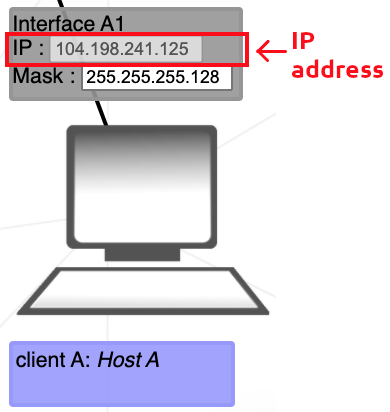</kbd>
</p>
</br>

IP, iletim kontrol protokolünü de içeren bir internet protokol paketinin parçasıdır. Bu ikisi birlikte TCP/IP olarak bilinir. İnternet protokol paketi, ağlar üzerinden verinin paketlenmesi, adreslenmesi, iletilmesi, yönlendirilmesi ve alınmasına ilişkin kuralları yönetir.

IP adresleme, ağdaki cihazlara adres atamanın mantıksal bir yoludur. İnternete bağlanan her cihazın benzersiz bir IP adresi olması gerekir.

Bir IP adresinin iki bölümü vardır; bir kısım bilgisayar veya başka bir cihaz gibi ana bilgisayarı tanımlarken, diğer kısım ait olduğu ağı tanımlar. TCP/IP bunları ayırmak için bir alt ağ maskesi kullanır.
 
### :candy: IPv4 - IPv6

IP adreslerinin 2 sürümü vardır: IPv4 ve IPv6:

```
# IPv4
40.252.255.255

# IPv6
ed14:458b:d1f2:fabd:124f:ad12:da51:eb71
```

İnternet Protokolü sürüm 4 (IPv4), IP adresini 32 bitlik bir sayı olarak tanımlar. Ancak İnternet'in büyümesi ve mevcut IPv4 adreslerinin tükenmesi nedeniyle, IP adresi için 128 bit kullanan yeni bir IP sürümü (IPv6) 1998'de standartlaştırıldı. Ancak NetPractice'te yalnızca IPv4 adresleri kullanılıyor.

### :ice_cube: Genel Adres - Özel Adres

Genel IP adresi, doğrudan internet üzerinden erişilebilen ve internet servis sağlayıcınız (ISP) tarafından ağ yönlendiricinize atanan bir IP adresidir. Genel (veya harici) bir IP adresi, ağınızın içinden ve ağınızın dışından internete bağlanmanıza yardımcı olur.

Özel IP adresi, ağ yönlendiricinizin cihazınıza atadığı bir adrestir. Aynı ağdaki her cihaza benzersiz bir özel IP adresi (bazen özel ağ adresi olarak da adlandırılır) atanır; bu, aynı dahili ağdaki cihazların birbirleriyle nasıl konuştuğudur.

Bir ağ internete bağlandığında, ayrılmış özel IP adreslerinden bir IP adresini kullanamaz. Aşağıdaki aralıklar özel IP adresleri için ayrılmıştır:

```
192.168.0.0 – 192.168.255.255 (65,536 IP addresses)
172.16.0.0 – 172.31.255.255   (1,048,576 IP addresses)
10.0.0.0 – 10.255.255.255     (16,777,216 IP addresses)
```

## :plate_with_cutlery: TCP

TCP, İletim Kontrol Protokolü anlamına gelir. Uygulama programlarının ve cihazların ağ üzerinden mesaj alışverişi yapmasını sağlayan bir iletişim standardıdır. İnternet üzerinden paket göndermek için kullanılır.

TCP, bir ağ üzerinden iletilen verilerin bütünlüğünü garanti eder. Verileri iletmeden önce TCP, kaynak ile hedef arasında iletişim başlayana kadar aktif kalan bir bağlantı kurar. Daha sonra büyük miktarda veriyi daha küçük paketlere bölerek herhangi bir veri kaybı olmadan uçtan uca teslimatı sağlar.

## :mag_right: TCP/IP Adresleme

</br>
<p align="center">
  <kbd>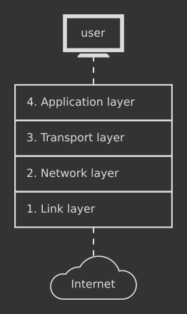</kbd>
</p>
</br>

TCP/IP, verilerin paketlere nasıl bölüneceğini, adresleneceğini, iletileceğini, yönlendirileceğini ve hedefte nasıl alınacağını belirleyen uçtan uca iletişim sağlayarak verilerin internet üzerinden nasıl alınıp verildiğini belirtir. TCP/IP çok az merkezi yönetim gerektirir ve ağdaki herhangi bir aygıtın arızalanması durumunda otomatik olarak kurtarma özelliğiyle ağları güvenilir kılmak için tasarlanmıştır.

IP paketindeki iki ana protokol belirli işlevlere hizmet eder. TCP, uygulamaların bir ağ üzerinde nasıl iletişim kanalları oluşturabileceğini tanımlar. Ayrıca bir mesajın internet üzerinden iletilmeden ve hedef adreste doğru sırada yeniden bir araya getirilmeden önce daha küçük paketlere nasıl birleştirildiğini de yönetir.

## :roller_coaster: OSI Modeli

</br>
<p align="center">
  <kbd>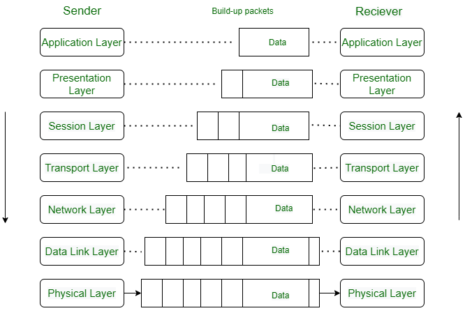</kbd>
</p>
</br>

OSI (Açık Sistem Arayüzü) modeli, ağ oluşturma ve ağ protokollerini anlamak için önemli bir teorik çerçeve sağlar. Bu model, ağı yedi katmana (katmanlara) böler; her katman belirli bir işlevi veya hizmeti temsil eder. Her katman, altındaki ve üstündeki katmanlarla belirli bir şekilde etkileşime girer.

Günümüzde OSI modeli ağ mühendisliği, ağ yönetimi ve ağ protokollerinin tasarlanması ve anlaşılmasında hala önemlidir. Özellikle ağ protokollerinin ve ağ teknolojilerinin karmaşıklığının artmasıyla birlikte ağdaki iletişim süreçlerini anlamak ve sorunlarını gidermek için OSI modeli kullanılmaktadır.

Ancak pratikte ağ mühendisleri ve sistem yöneticileri genellikle daha spesifik ve uygulamaya yönelik modelleri (örneğin TCP/IP modeli) tercih ederler. TCP/IP modeli daha çok internet protokollerini tanımlamak ve TCP/IP tabanlı ağların tasarımını ve yönetimini kolaylaştırmak için kullanılır.

Bununla birlikte, OSI modelinin temel ilkeleri ve katmanlar arası iletişim kavramları, ağ mühendisliği ve iletişim teknolojilerinin temelini oluşturan önemli bir teorik temsil sağlamaya devam etmektedir. Bu nedenle OSI modeli, ağ oluşturma için teorik bir temel sağlaması açısından hala değerlidir.

### :statue_of_liberty: MAC Adress (Physical Adress)

</br>
<p align="center">
  <kbd>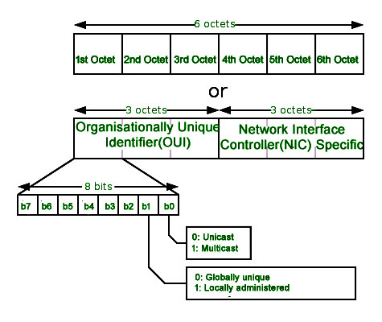</kbd>
</p>
</br>

MAC Adresleri, üretim sırasında bir ağ kartına (Ağ Arayüz Kartı olarak bilinir) yerleştirilen, bilgisayarın benzersiz 48 bitlik donanım numaralarıdır. MAC Adresi aynı zamanda bir ağ cihazının Fiziksel Adresi olarak da bilinir.

MAC adresi, Veri Bağlantı Katmanının Medya Erişim Kontrolü (MAC) alt katmanı tarafından kullanılır. Milyonlarca ağ cihazı mevcut olduğundan MAC Adresi dünya çapında benzersizdir ve her birini benzersiz şekilde tanımlamamız gerekir.

MAC adresinin ne olduğunu anlamak için öncelikle MAC Adresinin formatını anlamanız çok önemlidir. Yani bir MAC Adresi, çoğunlukla iki nokta üst üste-onaltılık gösterimle temsil edilen 12 basamaklı onaltılık bir sayıdır (6 bitlik ikili sayı).

MAC Adresinin ilk 6 hanesi (örneğin 00:40:96), OUI (Kurumsal Benzersiz Tanımlayıcı) adı verilen üreticiyi tanımlar. IEEE Kayıt Otoritesi Komitesi bu MAC öneklerini kayıtlı satıcılarına atar.

İşte tanınmış üreticilerin bazı OUI'leri:

```
CC:46:D6 - Cisco 
3C:5A:B4 - Google, Inc.
3C:D9:2B - Hewlett Packard
00:9A:CD - HUAWEI TECHNOLOGIES CO.,LTD
```
En sağdaki altı rakam, üretici tarafından atanan Ağ Arayüzü Denetleyicisini temsil eder.

Yukarıda tartışıldığı gibi, MAC adresi İki Noktalı Onaltılı gösterimle temsil edilir. Ancak bu sadece bir dönüşümdür, zorunlu değildir. MAC adresi aşağıdaki formatlardan herhangi biri kullanılarak temsil edilebilir:

```
# Hypen-Hexadecimal notaion
00-0a-83-b1-c0-8e
# Colon-Hexadecimal notaion
00:0a:83:b1:c0:8e
# Period-separated hexadecimal notaion
000.a83.b1c.08e
```

_Not: Linux işletim sistemi tarafından iki nokta üst üste onaltılık gösterim kullanılır ve Cisco Systems tarafından noktayla ayrılmış onaltılık gösterim kullanılır._

## 🤿 Alt Ağ Maskesi

</br>
<p align="center">
  <kbd>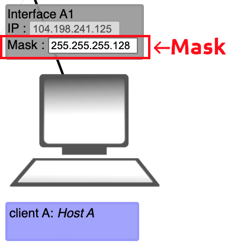</kbd>
</p>
</br>

Alt ağ maskesi, IP adresindeki bir ağ adresi ile ana bilgisayar adresini birbirinden ayırmak için kullanılan 32 bitlik (4 bayt) bir adrestir. Bir ağda veya alt ağda kullanılabilecek IP adresi aralığını tanımlar.

Amaç ağ trafiğini azaltmak, güvenliği sağlamak ve ağı segmentlere ayırarak alt ağlar sağlamaktır.

### :roller_skate: Ağ adresini bulma

_Not: Bir alt ağda, 1 bitin ağı, 0 bitin ise ana bilgisayarları temsil ettiğini düşünebiliriz (1 bit ve 0 bit savaşları)_

Yukarıdaki _A1_ Arayüzü aşağıdaki özelliklere sahiptir:

```
IP address | 104.198.241.125
Mask       | 255.255.255.128
```

IP adresinin hangi bölümünün ağ adresi olduğunu belirlemek için IP adresine maske uygulamamız gerekir. Önce maskeyi ikili forma dönüştürelim:

```
Mask | 11111111.11111111.11111111.10000000
```

Maskenin 1 olan bitleri ağ adresini temsil ederken, maskenin 0 olan geri kalan bitleri ana bilgisayar adresini temsil eder. Şimdi IP adresini ikili forma dönüştürelim:

```
IP address | 01101000.11000110.11110001.01111101
Mask       | 11111111.11111111.11111111.10000000
```

Artık IP'nin ağ adresini bulmak için [bitwise AND](https://en.wikipedia.org/wiki/Bitwise_operation#AND) aracılığıyla maskeyi IP adresine uygulayabiliriz:

```
Network address | 01101000.11000110.11110001.00000000
```

Bu, `104.198.241.0` ağ adresine karşılık gelir.
</br>
</br>

### :fuelpump: Ana bilgisayar adresleri aralığını bulma

Ağımızda hangi ana bilgisayar adreslerini kullanabileceğimizi belirlemek için IP adresimizin ana bilgisayar adresine ayrılmış bitlerini kullanmamız gerekir. Önceki IP adresimizi ve maskemizi kullanalım:

```
IP address | 01101000.11000110.11110001.01111101
Mask       | 11111111.11111111.11111111.10000000
```

Ana bilgisayar adreslerimizin olası aralığı, maskenin tümü 0 olan son 7 biti aracılığıyla ifade edilir. Bu nedenle, ana bilgisayar adreslerinin aralığı şöyledir:

```
BINARY  | 0000000 - 1111111
DECIMAL | 0 - 127
```

Ağımız için olası IP adresleri aralığını elde etmek için, ana bilgisayar adresleri aralığını ağ adresine ekliyoruz. Olası IP adresi aralığımız `104.198.241.0 - 104.198.241.127` olur.

<ins>Bununla birlikte</ins>, aralığın uçları belirli kullanımlar için ayrılmıştır ve bir arayüze verilemez:

```
104.198.241.0   | Reserved to represent the network address.
104.198.241.127 | Reserved as the broadcast address; used to send packets to all hosts of a network.
```

Bu nedenle, gerçek IP aralığımız `104.198.241.1 - 104.198.241.126` olur ve bu, bir [IP hesaplayıcı](https://www.calculator.net/ip-subnet-calculator.html) kullanılarak bulunabilir.
</br>
</br>

### :oncoming_automobile: CIDR Notasyonu (/24)

Maske aynı zamanda Sınıfsız Etki Alanları Arası Yönlendirme (CIDR) ile de temsil edilebilir. Bu form, maskeyi eğik çizgi `/` olarak temsil eder ve ardından ağ adresi olarak görev yapan bit sayısı gelir.

Bu nedenle, yukarıdaki `255.255.255.128` örneğindeki maske, CIDR gösterimini kullanan `/25` maskesine eşdeğerdir, çünkü 32 bitin 25 biti ağ adresini temsil eder.

#### :canoe: Küçük bilgiler

`/24` (255.255.255.0) bir alt ağ maskesini temsil eder ve CIDR (Sınıfsız Etki Alanları Arası Yönlendirme) gösteriminde kullanılır. Bu gösterim, IP adresinin hangi kısmının ağ kısmı, hangisinin ana bilgisayar kısmı olduğunu gösterir.

Örneğin, `192.168.1.0/24` IP adresi şu şekilde tanımlanır:

    "192.168.1.0" IP adresi ağın başlangıç ​​IP adresidir.
    "/24" alt ağ maskesini temsil eder ve ağ bölümünün ilk 24 bitini (8 bit x 3 sekizli) ifade eder.

Bu durumda `192.168.1.0/24` ifadesi aşağıdakileri belirtir:

    Ağ segmenti: İlk üç sekizli (192.168.1)
    Ana makine bölümü: Son sekizli (0)
    Alt ağ maskesi: İlk 24 bit (255.255.255.0)

Ağ segmenti belirli bir IP adresi aralığını temsil eder ve bu ağdaki cihazlar bu IP adresi aralığında bulunur. `/24`, alt ağ maskesinin ilk 24 bitinin ağ bölümünü, geri kalan bitlerin ise ana bilgisayar bölümünü temsil ettiğini gösterir.

Genel olarak, `/24`, belirli bir IP adresi aralığının alt ağ maskesini hızlı bir şekilde tanımlamak için ağ tasarımında ve IP adresi yönetiminde kullanılan bir gösterimdir. Bu gösterim, ağın boyutunu ve IP adresi dağılımını tanımlamak için oldukça yaygındır.

---

##### :ship: Uzun Hesaplama

Alt ağ maskesini CIDR (Sınıfsız Etki Alanları Arası Yönlendirme) notasyonuna dönüştürmek için kaç bitin 1 olduğunu belirlemeniz gerekir. Bu, 1'ler sayılarak yapılır. `255.255.255.252` alt ağ maskesi örneğini ele alalım:

    255 represents a segment of 8 bits. (11111111)
    255 represents another 8-bit segment. (11111111)
    255 represents another 8-bit segment. (11111111)
    252 represents a 2-bit segment. (11111100)

Toplamda 8 + 8 + 8 + 8 + 6 = 30 bit 1 olan bir alt ağ maskemiz var.

Bu durumda CIDR gösterimi `/30` olacaktır. Bunun nedeni, CIDR gösteriminin alt ağ maskesindeki 1'lerin sayısını belirtmesidir. Yani alt ağ maskesi `255.255.255.252`'dir.
CIDR gösteriminde `/30` olarak ifade edilir.

---

##### ⛴️ Kısa Hesaplama

IPv4 adresi 32 bit uzunluğunda olduğundan ve bu 4 sekizliye bölündüğünden, her sekizli 0 ila 255 (0 - 255) arasında yani 2^8'den maksimum 256 sayı alabilir.
Bu sekizlilerin ilk 3'ü (yukarıdaki örnek için) `255` olduğundan 3*8'den 24 bit elde ederiz.

(Not: Ancak `/26` örneğini ele alırsak daha kısa olan hesaplamadan hesaplama yapmak zor olabilir, bu durumda daha uzun olan hesaplamayı kullanmak faydalı olabilir).

---

##### :rocket: Ana Bilgisayar Hesaplaması - Cihaz Sayısı

Ana bilgisayar bölümü 32 olacaktır - CIDR'nin uzunluğu. Örneğin, `/24` için ana bilgisayar bölümü 32 - 24 = 8 bit olacaktır. 2^8'den 256 sayısını elde ederiz.
256 adet IP adresi içerir ancak bunlardan biri "ağ adresidir (örneğin modemin ağ arayüzüne bu şekilde ulaşabiliriz)" ve biri de yayın adresidir.
(broadcast - tüm cihazlara aynı anda paket göndermek için ayrılmış bir adres), cihazlara atanabilecek mevcut IP adreslerinin sayısı 256 - 2 = 254'tür.

Bu durumu daha iyi anlamak için:

    Network address: 192.168.1.0
    First available IP: 192.168.1.1
    Last available IP: 192.168.1.254
    Broadcast address 192.168.1.255

Bu nedenle, `192.168.1.0/24` alt ağı 256 IP adresine sahiptir ancak ağ adresi ve yayın adresi mevcut olmadığından mevcut IP adresi sayısı 254'tür.

---

##### :parachute: Alt Ağ Hesaplaması
Bit sayısı azaldıkça cihaz ve alt ağ sayısı artar, bit sayısı arttıkça alt ağ ve cihaz sayısı azalır.

Örneğin `255.255.255.252` alt ağ maskesini kullandığımızda 22 bit elde ediyoruz, 3. oktette bir azalma oluyor ve 256'dan 252'yi çıkardığımızda 4 sayısını elde ediyoruz, yani bir ağ 4 alt ağa bölünmüş oluyor. Her ağ (örneğin, `192.168.0.X` -> Alt Ağ 1 - `192.168.1.X` -> Alt Ağ 2 - `192.168.2.X` -> Alt Ağ 3 - `192.168.3.X` - > Subnet 4)'te 256 IP adresi var, toplam 1024 IP adresimiz var. Dikkat, segmentlere ayrılan ağların her birinin kendine özgü bir yayın ve ağ adresi yoktur çünkü ağ 1'dir, burada yapılan aslında ağın sınıflandırılması gibidir. Dolayısıyla aynı şekilde ilk adres olan `192.168.0.0` ağ adresi, `192.168.3.255` ise yayın adresi olacağından bu durumda atanabilir ve kullanılabilir IP adreslerinin sayısı 1022 olacaktır.

Örneğin, `192.168.0.26` ve `192.168.1.54` IP adresleri, `255.255.255.252` alt ağ maskesi kullanıldığında farklı alt ağlara aittir. Bu durumda bu iki IP adresi birbiriyle doğrudan iletişim kuramaz.

Alt ağ maskesi `255.255.255.252` ile belirtildiğinde alt ağların her biri 4 IP adresi kaplar.

`192.168.0.26` ve `192.168.1.54` IP adresleri, biri Alt Ağ 1'de ve diğeri Alt Ağ 2'de olmak üzere farklı alt ağlara aittir ve bu nedenle doğrudan iletişim kuramaz. 

(Farklı departmanlar gibi düşünülebilir, aslında aynı ağ üzerinde ama farklı alt ağlardalar) İki cihaz arasında iletişim kurabilmek için bu iki alt ağ arasına bir yönlendirici vb. bağlanması gerekir. Bir yönlendiricinin veya benzer bir cihazın bu iki alt ağ arasındaki iletişimi yönlendirmesi gerekecektir.


##### :first_quarter_moon_with_face: Örnek

Bir ağda alt ağ maskesi `255.255.255.224`, bir cihazın IP adresi `94.54.250.222`, diğer cihazın IP adresi `X` olsun.
IP adresi `X` olan bu cihazın `94.54.250.222` ile iletişim kurabilmesi için IP adresi ne olmalıdır?

CIDR hesaplamasından (kaç tanesinin 1 bit olduğunun hesaplanması) 27 1 bit olduğu ortaya çıkıyor: `/27`

IPv4'ün maksimum uzunluğu 32 bit ise (yani 32 1 bit varsa), o zaman dördüncü, son sekizlinin 0 bit sayısı 32 - 27 üzerinden 5'tir ve artık 3 bitin 1 bit olduğu bilinmektedir. 8 - 5 arasında.

Ana bilgisayar sayısı 2^5'ten `32` ise ve biri ağ adresi, biri yayın adresi ise, 32 - 2 bu ağda kullanılabilen 30 IP adresini verir.

Verilen alt ağ maskesi `255.255.255.224` ile birlikte her alt ağda 32 IP adresi bulunur (2^5 = 32).
Bu IP adresleri içerisinde ilk IP adresi ağ adresini, sonraki 30 IP adresi mevcut adresleri ve son IP adresi ise yayın adresini temsil eder.

Son sekizlideki 0 bit sayısı 5 olduğundan kalan 1 bitin toplamı 8 bit olacağından 3 olur.

Yani bu ağ 2^3'ü 8 alt ağa bölebilir. Maksimum IP sayımız 256 olduğundan, her bir alt ağda 256 / 8'den maksimum 32 IP adresi bulunur (bu hesaplama yukarıda hesaplanan 2^5'ten doğrulanabilir).

Bu nedenle `255.255.255.224` alt ağ maskesiyle oluşturulan bir ağ, 32 IP adresli 8 alt ağ kombinasyonuna sahip olabilir.

Bu alt ağlar aşağıdaki şekilde temsil edilir:

```
Network Adress	             Usable Host Range		       Broadcast Adress

94.54.250.0		94.54.250.1 - 94.54.250.30		94.54.250.31
94.54.250.32		94.54.250.33 - 94.54.250.62		94.54.250.63
94.54.250.64		94.54.250.65 - 94.54.250.94		94.54.250.95
94.54.250.96		94.54.250.97 - 94.54.250.126		94.54.250.127
94.54.250.128		94.54.250.129 - 94.54.250.158		94.54.250.159
94.54.250.160		94.54.250.161 - 94.54.250.190		94.54.250.191
94.54.250.192		94.54.250.193 - 94.54.250.222		94.54.250.223
94.54.250.224		94.54.250.225 - 94.54.250.254		94.54.250.255
```

Her alt ağ 32 IP adresi içerir.

> [!WARNING]
> Her kombinasyonun ağ adresi farklıdır.
> Örneğin IP adresi `94.54.250.165` ve alt ağ maskesi `255.255.255.224` olan bir cihazın ağ adresi `94.54.250.160`'dır.
> 
> Alt ağ adresi `255.255.255.224` olan bir ağ 8 farklı alt ağ kombinasyonuna bölündüğü için ilk adres `94.54.250.165` olur.
> ağ adresi `94.54.250.160`, son adres ise yayın adresi `94.54.250.191` olacaktır.
>
> Veya ağ adresi, yalnızca ağ adresi hesaplanarak bulunabilir.

> [!TIP]
> Bash'ta `echo` ve `bc` komutlarını bir arada kullanarak bir sayının ikili dizisini elde edebiliriz.
> ```
> # Bir sayının ikilisi
> echo "obase=2; <number>" | bc
> ```
> Elbette ağ adresini bulmanıza da yardımcı olabilir.
> Ya da
> Bir cihazın direkt ağ adresini bulmak istiyorsanız aşağıdaki komutu kullanabilirsiniz.
> ```
> # Ağ adresini bulmak için
> echo "$((<number> & <number>))"
> ```
> **Örnekler**
> `94.54.250.165` ve `255.255.255.224` alt ağına:
> ```
> $ echo "$((165 & 224))"
> $ 160
> ```
> Yani ağ adresi `94.54.250.160`
> Ya da
> `255.255.255.224` için CIDR hesaplaması
> ```
> $ echo "obase=2; 224" | bc
> $ 11100000
> ```
> Yani CIDR `/27`'dir.

`255.255.255.224` (CIDR gösteriminde /27) alt ağ maskesi verildiğinde, bu IP adreslerinin 8 farklı alt ağ kombinasyonu olacak ve her kombinasyonun 32 seviye aralığı olacaktır.
İlk üç sekizli '255.255.255'te maskenin tüm bitleri 1'e ayarlanmıştır, dolayısıyla bu parçalar sabittir. Ancak dördüncü sekizli '224'te ilk 3 bit 1'e, kalan 5 bit ise 0'a ayarlanmıştır.

Bu durumda 3 bit kullanılarak 2^3 veya 8 farklı kombinasyon elde edilebilir. Her kombinasyon bir alt ağı temsil eder.
İlk alt ağ için 3 bitin tamamı 0'a ayarlandığında, sonraki alt ağ için ilk bit 1'e ayarlandığında, ikinci alt ağ için ikinci bit 1'e ayarlandığında vb.

Bu 3 bitlik kombinasyonlar aşağıdaki gibidir:

```
Subnet: 000
Subnet: 001
Subnet: 010
Subnet: 011
Subnet: 100
Subnet: 101
Subnet: 110
Subnet: 111
```

Her kombinasyon bir alt ağı temsil eder. Bu 8 alt ağın her biri 32 aralık adresi içerir. Bu nedenle `255.255.255.224` alt ağ maskesi ile oluşturulan ağ, 8 farklı alt ağ kombinasyonunu içermektedir.

_**Farklı çözüm:**_

Son sekizli 224 ise, farkı bulun ve 256'ya kadar toplayın; 256 - 224, 32'ye eşittir. Bu, her alt ağın 32 IP adresine sahip olduğu anlamına gelir.

Kaç farklı alt ağ kombinasyonunun olduğunu bulmak için 256/32 8 farklı alt ağ kombinasyonu verir.

CIDR hesaplaması için 8 farklı alt ağımız varsa 2^3'ten 8 sayısını aldığımızı doğrularız yani 3 bit 1 dersek.
İlk 3 sekizli (1'ler ağı temsil eder) zaten 255 olduğundan, 24 + 3 `/27` CIDR'sini elde ederiz.

</br>

---

## :fireworks: Cihazlar

### :ocean: Anahtar

</br>
<p align="center">
  <kbd>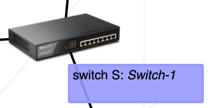</kbd>
</p>
</br>

Bir anahtar birden fazla cihazı tek bir ağda birbirine bağlar. Yönlendiriciden farklı olarak anahtarın herhangi bir arabirimi yoktur, çünkü paketleri yalnızca yerel ağına dağıtır ve kendi dışındaki bir ağla doğrudan konuşamaz.

---

### :snowflake: Yönlendirici

</br>
<p align="center">
  <kbd>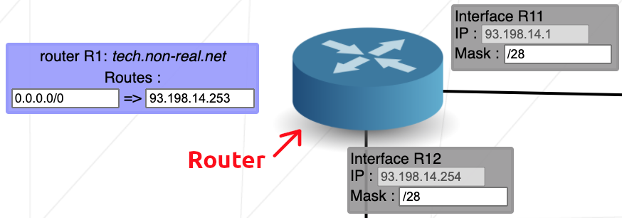</kbd>
</p>
</br>

Anahtarın birden fazla cihazı tek bir ağa bağlaması gibi, yönlendirici de birden fazla ağı birbirine bağlar. Yönlendiricinin bağlandığı her ağ için bir arayüzü vardır.

Yönlendirici farklı ağları ayırdığından, arayüzlerinden birindeki olası IP adreslerinin aralığı diğer arayüzlerin aralığıyla çakışmamalıdır. IP adresi aralığındaki bir çakışma, arayüzlerin aynı ağ üzerinde olduğu anlamına gelir.
</br>
</br>

#### :open_umbrella: Yönlendirme Tablosu

</br>
<p align="center">
  <kbd>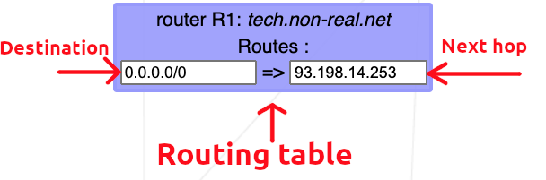</kbd>
</p>
</br>

Yönlendirme tablosu, bir yönlendiricide veya ağ ana bilgisayarında saklanan ve belirli ağ hedeflerine giden yolları listeleyen bir veri tablosudur. NetPractice'te yönlendirme tablosu 2 öğeden oluşur:

- **Hedef**: Hedef, paketlerin son hedefinin ana bilgisayar olduğu bir ağ adresini belirtir. `Varsayılan` veya `0.0.0.0/0` rotası, bir IP hedef adresi için başka bir rota bulunmadığında etkili olan rotadır. Varsayılan rota, paketleri belirli bir hedef vermeden yollarına göndermek için sonraki atlama adresini kullanacaktır. Varsayılan rota herhangi bir ağla eşleşecektir.

- **Sonraki atlama**: Sonraki atlama, bir paketin geçebileceği bir sonraki en yakın yönlendiriciyi ifade eder. Paketin yolundaki bir sonraki yönlendiricinin IP adresidir. Her bir yönlendirici, yönlendirme tablosunu bir sonraki atlama adresiyle korur.


Örneğin, bir ağda her biri farklı alt ağlarda bulunan bir yönlendirici ve 1 cihaz vardır:

```
              MachineB --> IP: 152.249.225.253
             /		   Mask: 255.255.192.0    
            /				               Client B: Machine B
           / 	 					     Routes:
          /					    default => 152.249.225.254
         /
        /
      Interface R2 --> IP: 152.249.225.254
      /                Mask: 255.255.192.0
Router
      \
      Interface R1 --> IP: 90.15.153.126
        \             Mask: 255.255.255.128
         \
          \
           \
            \
             \
              MachineA --> IP: 90.15.153.125
                           Mask: 255.255.255.128

                                                   Client A: Machine A
                                                        Routes:
                                            152.249.0.0/16 => 90.15.153.126
```

1. IP Adres Aralığı (Hedef): '152.249.0.0/16' bir IP adresi aralığını ifade eder. Bu ifade, '152.249.0.0' IP adresinden başlayarak '152.249.255.255' IP adresine kadar tüm IP adreslerini içerir. '/16' gösterimi, bu IP aralığının ilk iki 16 bitinin (1. ve 2. bayt) ağ adresini temsil ettiğini gösterir. Bu, '152.249' ile başlayan tüm IP adreslerini içerir.

2. Yönlendirici IP Adresi (Sonraki Atlama): '90.15.153.126' yönlendiricinin IP adresini temsil eder. Bu IP adresi, ağdaki bir yönlendiricinin arayüzüne atanan IP adresidir. Ana bilgisayarlar bu yönlendirici IP adresini kullanarak iletişim kurar ve yönlendirici bu iletişimi farklı ağlar arasında yönlendirme yaparak sağlar.

3. **varsayılan**:

IP adresi aralığında, 'varsayılan' terimi genellikle varsayılan bir ağ geçidini ifade eder. Bu, bir cihazın iletişim kurmak istediği hedef IP adresinin aynı alt ağda olmaması durumunda trafiği yönlendirirken kullanılan varsayılan rota anlamına gelir.

Genellikle bir bilgisayarın veya cihazın ağ ayarlarında belirtilen varsayılan ağ geçidi, cihazın ağı dışındaki hedeflere ulaşmak için kullanılır. Bir cihazın iletişim kurmak istediği IP adresi aynı alt ağda değilse, varsayılan ağ geçidi üzerinden yönlendirilir.

Örneğin, bir bilgisayarın IP adresi "192.168.1.10" ve ağ geçidi "192.168.1.1" ise, "192.168.1.1" varsayılan ağ geçidi olarak kabul edilir. Bir bilgisayar aynı alt ağdaki bir cihaza ulaşmak istediğinde doğrudan iletişim kurabilir. Ancak aynı alt ağda olmayan bir hedefe ulaşmak istediğinde trafik varsayılan ağ geçidi üzerinden yönlendirilir.

Hedef 'varsayılan', '0.0.0.0/0'a eşdeğerdir.

---

## :zap: Tamamlanan Seviyeler

<details>
  <summary>Bölüm 1</summary>
  <br>
  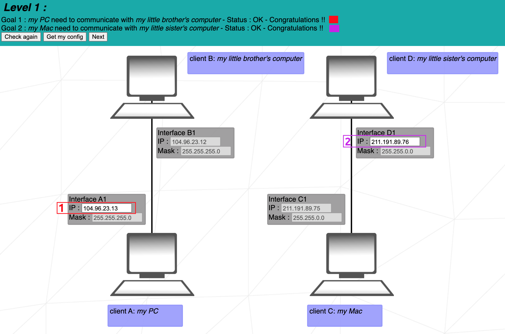  
  <br>
  <br>

**1.** _Client A_ ve _Client B_ aynı ağda olduğundan, IP adreslerinin alt ağ maskesine uygun olarak aynı ağı temsil etmesi gerekir.
<br>
Alt ağ maskesi _255.255.255.0_'dır; bu, IP adresinin ilk 3 baytının ağı, 4. baytının da ana bilgisayarı temsil ettiği anlamına gelir. Aynı ağda olduğumuz için sadece host değişebilir.
<br>
Çözüm, aşağıdaki 3 hariç **104.96.23.0 - 104.96.23.255** aralığındaki herhangi bir şey olacaktır:

- **104.96.23.0:** Ana bilgisayar aralığındaki ilk sayı (bu durumda 0) ağı temsil eder ve bir ana bilgisayar tarafından kullanılamaz.
- **104.96.23.255:** Ana bilgisayar aralığındaki son sayı (bu durumda 255) yayın adresini temsil eder.
- **104.96.23.12:** This address is already used by the host _Client B_.

**2.** _1._ ile aynı mantık, ancak bu durumda alt ağ maskesi _255.255.0.0_'dır. IP adresinin ilk 2 baytı ağı temsil edecektir; ve son 2 bayt, ana bilgisayar adresi.
<br>
Çözüm, **211.191.0.0 - 211.191.255.255** aralığındaki herhangi bir şey olacaktır; ancak aşağıdakiler hariç:

- **211.191.0.0:** Ağ adresini temsil eder.
- **211.191.255.255:** Yayın adresini temsil eder.
- **211.191.89.75:** Zaten _Client C_ ana bilgisayarı tarafından alınmış.

</br>

</details>

---

<details>
  <summary>Bölüm 2</summary>
  <br>
  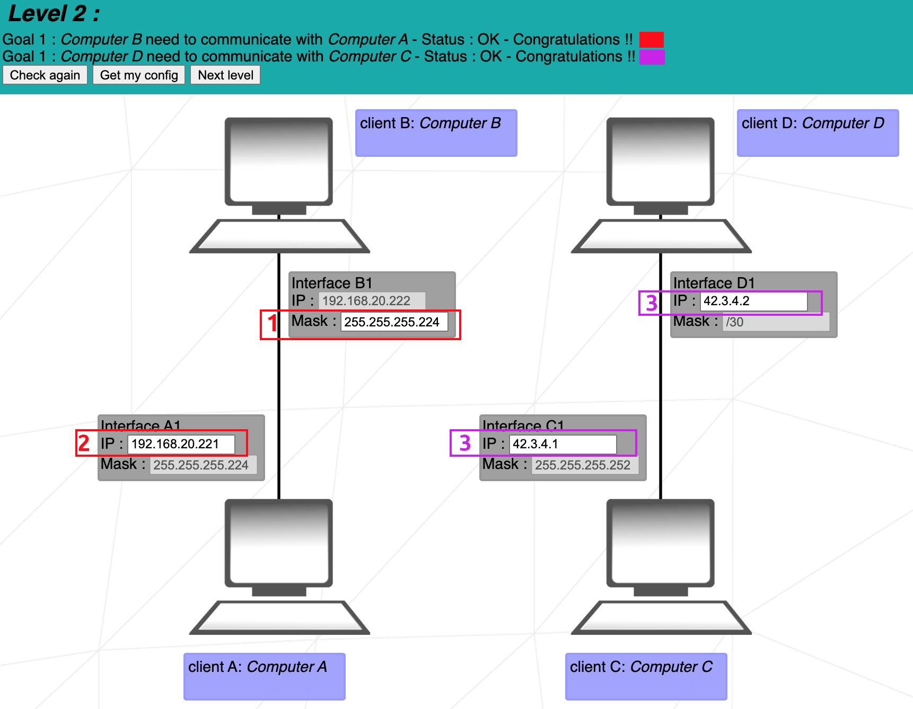
  <br>
  <br>

**1.** _İstemci B_, _İstemci A_ ile aynı özel ağda olduğundan, tam olarak aynı alt ağ maskesine sahip olmaları gerekir.
<br>
Çözüm yalnızca **255.255.255.224** olabilir.

**2.** _255.255.255.224_ alt ağ maskesini anlamak için, buna _Client B_'nin _192.168.20.222_ IP'siyle birlikte ikili biçimde bakalım:

<center>

```
MASK: 11111111.11111111.11111111.11100000
IP:   11000000.10101000.00010100.11011101
```

</center>
Gördüğümüz gibi ilk 27 bit IP adresini temsil ederken, yalnızca son 5 bit ana bilgisayar adresini temsil ediyor.
<br>
Ağı temsil eden bu 27 bitin tamamının, aynı ağdaki ana bilgisayarların IP adreslerinde aynı kalması gerekir. Cevabı almak için yalnızca son 5 biti değiştirebiliriz.
<br>
<br>
Cevap şu aralıktadır:

```
BIN:  11000000.10101000.00010100.11000000 - 11000000.10101000.00010100.11011111
or
DEC:  192.168.20.192 - 192.168.20.223
```

Hariç:
<br>

- **11000000.10101000.00010100.11000000:** Ağ adresini temsil eder (son 5 bitteki tüm 0'lara dikkat edin).
- **11000000.10101000.00010100.11011111:** Yayın adresini temsil eder (son 5 bitteki 1'in tümüne dikkat edin).
- **11000000.10101000.00010100.11011110:** _İstemci B_ zaten bu adrese sahip.

**3.** Burada _Arayüz D1_'deki alt ağ maskesi için eğik çizgi "/" gösterimini tanıttık. _/30_ alt ağ maskesi, IP adresinin ilk 30 bitinin ağ adresini, geri kalan 2 bitinin ise ana bilgisayar adresini temsil ettiği anlamına gelir:

<center>

```
Mask /30: 11111111.11111111.11111111.11111100
```

</center>

Bu ikili sayının _255.255.255.252_ ondalık sayıya karşılık geldiğini görebiliriz, dolayısıyla _Arayüz C1_'de bulunan maskeyle aynıdır.
<br>
<br>
Cevaplar, aşağıdaki koşulları karşıladıkları sürece herhangi bir adres olabilir:

- Ağ adresi (ilk 30 bit) _Client D_ ve _Client C_ için aynı olmalıdır.
- Ana bilgisayar bitlerinin (son 2 bit) tamamı 1 veya tamamı 0 olamaz.
- _Client D_ ve _Client C_ aynı IP adreslerine sahip değil.

</br>

</details>

---

<details>
  <summary>Bölüm 3</summary>
  <br>
  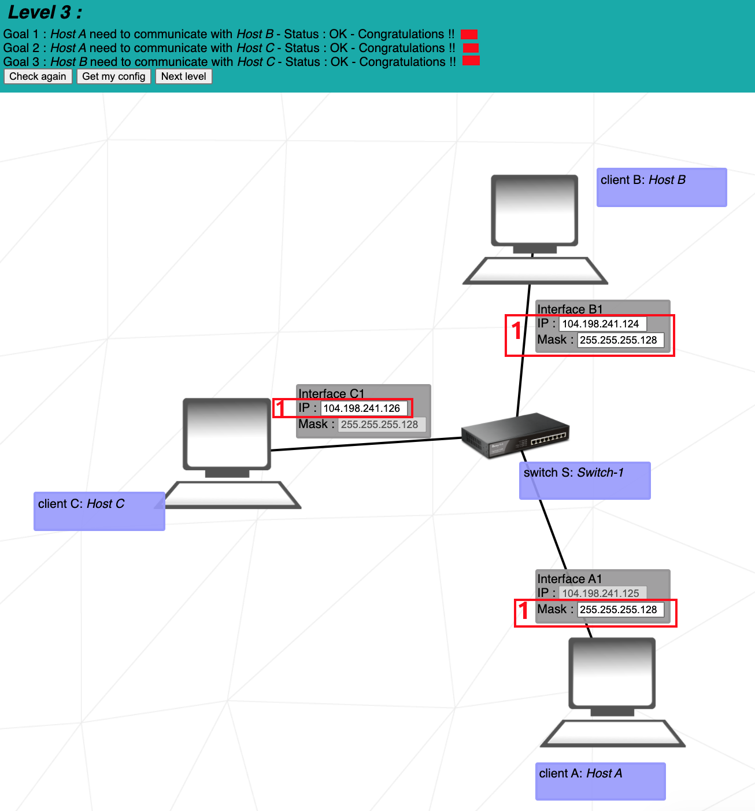
  <br>
  <br>

Bu alıştırmada **anahtarın** (bu örnekte _Switch S_) kullanımı anlatılmaktadır. Anahtar, aynı ağdaki birden fazla ana bilgisayarı birbirine bağlar.
<br>
<br>

**1.** _Client A_, _Client B_ ve _Client C_'nin tümü aynı ağ üzerindedir. Bu nedenle hepsinin aynı alt ağ maskesine sahip olması gerekir. _İstemci C_ zaten _255.255.255.128_ maskesine sahip olduğundan, _Arayüz B1_ ve _Arayüz A1_ için maske de _255.255.255.128_ olacaktır (veya eğik çizgi gösteriminde: _/25_).
<br>
<br>
_Arayüz B1_ ve _Arayüz C1_'in IP adresi, _İstemci A_'nın IP'si ile aynı ağ aralığında olmalıdır. Bu aralık:

  <center>

```
104.198.241.0 - 104.198.241.128
```

  </center>
  Elbette ağ adresi ve yayın adresi hariç.

</br>

</details>

---

<details>
  <summary>Bölüm 4</summary>
  <br>
  
  <br>
  <br>

Bu alıştırmada **yönlendirici** tanıtılmaktadır. Yönlendirici birden fazla ağı birbirine bağlamak için kullanılır. Bunu birden çok arabirimin kullanımıyla yapar (bu örnekte _Interface R1_, _Interface R2_ ve _Interface R3_).
<br>
<br>

**1.** _Arayüz B1_, _Arayüz A1_ ve _Arayüz R1_ üzerindeki maskelerin hiçbirine girilmediğinden, kendi alt ağ maskemizi seçmekte özgürüz. **/24** maskesi idealdir çünkü bize ana bilgisayar adresi için 4. baytın tamamını bırakır ve olası ana bilgisayar adresleri aralığını bulmak için ikili hesaplamalar gerektirmez.
<br>
<br>
_Arayüz B1_ ve _Arayüz R1_'in IP adresi, _Arayüz A1_'nin IP adresiyle aynı ağ adresine sahip olmalıdır. _/24_ alt ağıyla olası aralık şöyledir:

  <center>

```
85.17.5.0 - 85.17.5.255
```

  </center>
  Ağ adresi ve yayın adresi hariç.
  <br>
  <br>

İletişimlerimizin hiçbirinin yönlendiricinin bu taraflarına ulaşması gerekmediğinden, _Interface R2_ ve _Interface R3_ yönlendiricileriyle etkileşimde bulunmadığımızı unutmayın.

</br>

</details>

---

<details>
  <summary>Bölüm 5</summary>
  <br>
  
  <br>
  <br>

Bu seviyede **rotalar** tanıtılmaktadır. Bir rota 2 alan içerir; ilki giden paketlerin **hedefi**, ikincisi ise paketlerin **sonraki atlama noktasıdır**.
<br>

**hedef** _varsayılan_, _0.0.0.0/0_'ye eşdeğerdir; bu, paketleri ayrım gözetmeksizin karşılaştığı ilk ağ adresine gönderir. _122.3.5.3/24_ hedef adresi, paketleri _122.3.5.0_ ağına gönderecektir.

  <br>
  **Sonraki atlama**, mevcut makinenin arayüzünün paketlerini göndermesi gereken bir sonraki yönlendirici (veya internet) arayüzünün IP adresidir.
  <br>
  <br>

**1.** _Client A_'nın paketlerini gönderebileceği yalnızca 1 rotası vardır. Numaralandırılmış bir hedef belirlemenin faydası yoktur. Hedef _default_, paketleri mevcut tek yola gönderecektir.
<br>
<br>
Bir sonraki atlama adresi, paketlerin yolundaki bir sonraki yönlendiricinin arayüzünün IP adresi olmalıdır. Sonraki arayüz, _54.117.30.126_ IP adresine sahip _Arayüz R1_'dir. Bir sonraki arayüzün, gönderenin kendi arayüzü olduğundan, _Arabirim A1_ olmadığını unutmayın.

</br>

</details>

---

<details>
  <summary>Bölüm 6</summary>
  <br>
  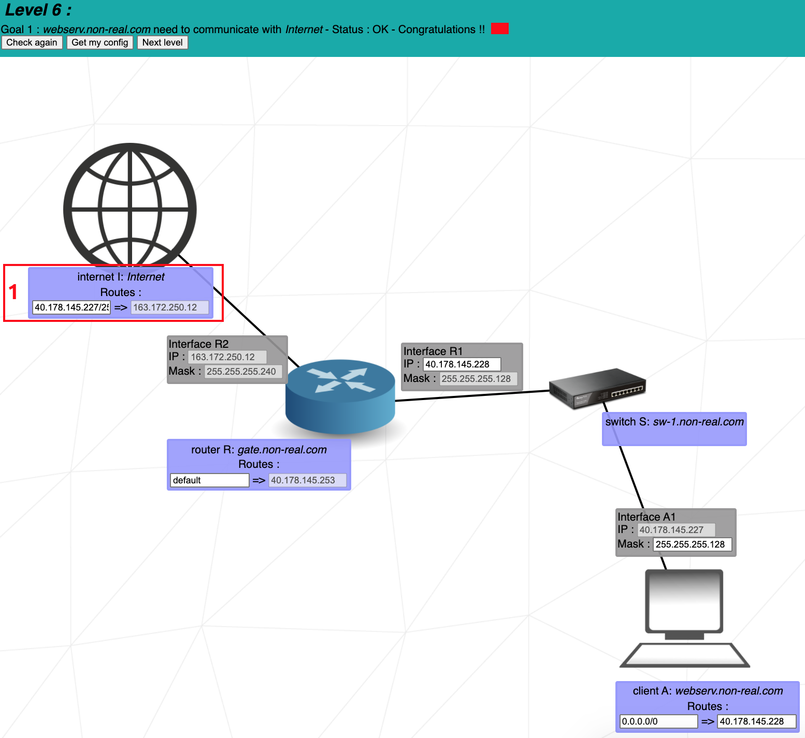
  <br>
  <br>

Bu seviye **internet**'i tanıtır. İnternet bir yönlendirici gibi davranır. Ancak, bir arayüz doğrudan veya dolaylı olarak internete bağlıysa, aşağıdaki ayrılmış özel IP aralıklarında bir IP adresine **sahip olamaz**:

```
192.168.0.0 - 192.168.255.255 (65,536 IP adres)
172.16.0.0 - 172.31.255.255   (1,048,576 IP adres)
10.0.0.0 - 10.255.255.255     (16,777,216 IP adres)
```

**1.** İnternetin **sonraki atlama noktası** zaten girilmiştir ve _Interface R2_'nin IP adresiyle eşleşir. Bu nedenle sadece internetin hedefiyle uğraşmamız gerekiyor.
<br>
<br>
İnternet, paketlerini _Client A_'a göndermelidir. Bunu yapmak için internetin hedefinin _Client A_'ın ağ adresiyle eşleşmesi gerekir. _Client A_'ın ağ adresini bulalım:
<br>
_İstemci A_'nın maskesi _255.255.255.128_'dir ve bu, _/25_'ye eşdeğerdir. Bu, IP adresinin ilk 25 bitinin ağ adresi olduğu anlamına gelir. O halde IP adresinin ilk 3 baytının (24 bit) ağ adresinin bir parçasını oluşturduğunu biliyoruz:

  <center>

```
40.178.145.?
```

  </center>

Şimdi sadece 25. bitin 1 mi yoksa 0 mı olduğunu bulmamız gerekiyor.
<br>
227 sayısını ikiliye çevirirsek '11100011' elde ederiz. 25. bit'e karşılık gelen ilk rakam 1'dir. Geriye kalan 7 bit değil, yalnızca 25. bit ağ adresinin bir parçası olduğundan, ağ adresinin son baytı için 128 olan "10000000" değerini alırız. ondalık olarak.
<br>
<br>
Tam ağ adresi:

  <center>

```
40.178.145.128
```

  </center>

Ana bilgisayar adresleri için _40.178.145.129 - 40.178.145.254_ aralığıyla.
<br>
<br>
Artık **40.178.145.128** adresini İnternet hedefine koyabiliriz. Hedef adresin ardından gelen **/25**, adrese uygulanan maskeyi temsil eder.
<br>
<br>
_40.178.145.227/25_ hedefi, _40.178.145.128/25_ hedef adresine eşdeğerdir, çünkü _/25_ maskesi, hedefin ağ adresini almak için 25'ten sonraki tüm bitleri 0'a çevirecektir.

</br>

</details>

---

<details>
  <summary>Bölüm 7</summary>
  <br>
  
  <br>
  <br>

Bu düzey **örtüşmeler** kavramını tanıtır. Bir ağın IP adresleri aralığı, ayrı bir ağın IP adresleri aralığıyla örtüşmemelidir. Ağlar yönlendiricilerle ayrılır.
<br>
<br>

**1.** 3 ayrı ağımız var:
<br>

1. _Client A_ ve _Router R1_ arasında.
2. _Router R1_ ve _Router R2_ arasında.
3. _Router R2_ ve _Client C_ arasında.

_Interface A1_ için, _Interface R11_'in IP'si zaten girilmiş olduğundan IP adresimizi serbestçe seçemiyoruz. Ayrıca _/24_ maskesini verirsek, IP adres aralığı zaten girilmiş olan _Interface R12_ aralığıyla örtüşecektir. Her ikisi de _93.198.14.0 - 93.198.14.255_ aralığında olacaktır.
<br>
<br>

3 ayrı ağ için adreslere ihtiyacımız olduğundan, adresin son baytlarını 4 veya daha fazla adres aralığına bölmek uygundur. Bunu _/26_ veya daha yüksek bir maske kullanarak yapıyoruz. Örneğin _/28_ maskesi bize 16 aralık verecektir ve bunlardan aşağıdaki 3'ü kullanacağız:

```
93.198.14.1 - 93.198.14.14    (Client A'dan Yönlendirici R1'e)
93.198.14.65 - 93.198.14.78   (Yönlendirici R1'den Yönlendirici R2'ye)
93.198.14.241 - 93.198.14.254 (Yönlendirici R2'den İstemci C'ye)
```

Bir maskenin olası aralıklarını hesaplamak için:
<br>
[Calculate IP/Subnet](https://www.calculator.net/ip-subnet-calculator.html)

</br>

</details>

---

<details>
  <summary>Bölüm 8</summary>
  <br>
  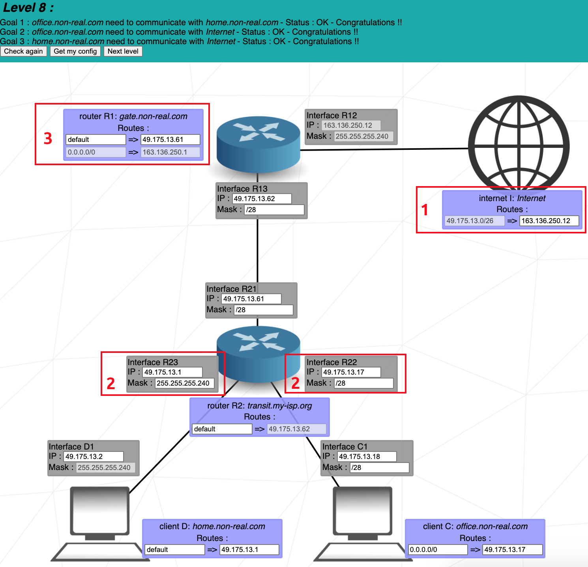
  <br>
  <br>

**1.** _Client C_ ve _Client D_ ana bilgisayarları internete paket gönderecek, ardından internet, paketleri ilk göndericiye geri göndererek yanıt verecektir. Bu paketleri göndermek için internet, paketleri '49.175.13.0 - 49.175.13.63' aralığındaki ağlara göndermek için _49.175.13.0/26_ hedefini kullanır.
<br>
<br>
Tüm alıcı ağlar birbiriyle örtüşmeden bu aralıkta olmalıdır.
<br>
<br>

**2.** _Interface R23_ ve _Interface R22_'de, hedef adresinden _/26_ aralığını uygun şekilde 4 ayrı aralığa bölmek için _255.255.255.240_ (veya _/28_) maskesini kullanırız. Üst üste gelmemesi gereken aşağıdaki 3 ağa sahip olduğumuz için 4'ün bu şekilde ayrılması gereklidir:
<br>

1. _Yönlendirici R1_'den _Yönlendirici R2_'ye.
2. _Yönlendirici R2_'den _İstemci C_'ye.
3. _Yönlendirici R2_'den _İstemci D_'ye.

Bu ağların her birine daha sonra _/28_ maskesiyle aşağıdaki IP aralıklarından biri atanabilir:

```
49.175.13.0 - 49.175.13.15
49.175.13.16 - 49.175.13.31
49.175.13.32 - 49.175.13.47
49.175.13.48 - 49.175.13.63
```

Ağ adresinin (ilk) ve yayın adresinin (sonuncu) her aralıktan hariç tutulması gerektiğini unutmayın.
<br>
<br>

**3.** İnternet için hedef ve sonraki atlama noktası zaten girilmiştir. Yalnızca _Interface R21_ üzerindeki IP olan _Router R2_ için bir sonraki hop'a girmemiz gerekiyor.

</br>

</details>

---

<details>
  <summary>Bölüm 9</summary>
  <br>
  
  <br>
  <br>

İnternet başlangıçta paketlerini belirli bir ağa göndermediğinden bu seviye oldukça basittir. Bu nedenle ayrı ağların ortak bir adres aralığını paylaşmasına gerek yoktur. Seviye tamamlanana kadar seviyedeki 6 hedefi tek tek takip etmenizi öneririm.
<br>
<br>
Ayrılmış özel IP aralıklarındaki ağ adreslerini kullanmamayı unutmayın.
<br>
<br>

**1.** **Hedef 3**, _meson_'u _internet_'e bağlamamız gerektiğini belirtir. Daha sonra _internet_'in _meson_'a yanıt vermesi gerekecek, bu nedenle _internet'in_ hedefine _meson'un_ ağ adresini giriyoruz.
<br>
<br>
**Hedef 6**, _cation_'ı _internet_'e bağlamamız gerektiğini belirtiyor, bu nedenle _cation'ın_ ağ adresini _internet'in_ hedefine giriyoruz.
<br>
<br>
_İnternet_'in 3. hedefi ve _Router R1'in_ hedefi için boş bir alanın olması normaldir. Yönlendirme tablolarının tüm alanlarının doldurulması gerekmez.

</br>

</details>

---

<details>
  <summary>Bölüm 10</summary>
  <br>
  
  <br>
  <br>

Bu seviyede 4 farklı ağ vardır:
<br>

1. _Yönlendirici R1_'den _Switch S1_'e
2. _Yönlendirici R1_'den _Yönlendirici R2_'ye
3. _Yönlendirici R2_'den _İstemci H4_'e
4. _Yönlendirici R2_'den _İstemci H3'e
   <br>

**1.** İnternet, paketlerini tüm ana bilgisayarlara gönderebilmelidir, dolayısıyla hedefi, tüm ana bilgisayarların ağ aralığını kapsamalıdır.
<br>
<br>

_Arayüz R11_ ve _Arayüz R13_ zaten girilmiş bir IP adresine sahip. Bu IP adresi yalnızca son baytında farklılık gösterir. _Interface R11_ son bayt için **1** içerir ve _Interface R13_ son bayt için **254** içerir. Bu geniş IP adres aralığını kapsamak amacıyla, _internetin_ hedefi için **/24** maskesini alıyoruz. Bu hedef "70.101.30.0 - 70.101.30.255" aralığını kapsayacaktır.

  <br>
  <br>

**2.** IP adreslerini seçerken 2 şeyden emin olmalıyız:
<br>

1. IP adresi _internet_ hedefi kapsamındadır.
2. Çeşitli ağların IP adresi aralığı çakışmıyor.
   <br>

Zaten girilen IP adresleri (gri renkte) ile çeşitli ağların kapsadığı aralıkları inceleyelim:
<br>

1. _Yönlendirici R1_ - _Anahtar S1_ - **70.101.30.0 - 70.101.30.127** aralığını kapsar (maske /25).
2. _Router R2_ - _Client H4_ - **70.101.30.128 - 70.101.30.191** aralığını kapsar (maske /26).
3. _Yönlendirici R1_ ila _Yönlendirici R2_ - **70.101.30.252 - 70.101.30.255** aralığını kapsar (maske /30).
4. _Yönlendirici R2_'den _İstemci H3_'e - ??? (maske ???).

"Yönlendirici R2'den İstemci H3'e" ağı için kalan tek IP adresleri **70.101.30.192 - 70.101.30.251**'dir. _Interface R22_ ve _Interface R31_'e koymak için bu aralıktan 2 IP adresi almamıza izin verecek herhangi bir maskeyi seçebiliriz.

</br>

</details>

---

## Net Practice Proje Dosyaları Hataları Hakkında

> [!WARNING]
> ### Problem 1
> **Net Practice** dosyasını bilgisayarınızda çalıştırmayı denediğinizde bazı bölümler eksikse (örneğin, üst mavi alanda _Check_, _Get My Config_ düğmeleri ve sağ alt köşede _error log_),
> muhtemelen show.js dosyasında bir hatayla karşılaşıyorsunuz. Bunu öğrenmek için tarayıcıda herhangi bir `levelX.html` dosyasını açın ve dosyayı **_Inspect_** modunda açarak bir hata olup olmadığını doğrulayın.
> Bir hata alıyor olabilirsiniz. Yukarıda bahsettiğim örnekleri çözmek için az önce bahsettiğim `show.js` dosyasında `g_eval_lvls` değişkeni için aşağıdaki çözümü bularak sorunu çözdüm.
> 
> ```
> // "show.js" dosyasındaki aşağıdaki fonksiyona aşağıdaki satırları ekleyin ve tekrar deneyin:
>
> function my_console_log(str)
> {
>   // console.log(str);
>   if(!g_eval_lvls)
>   {
>     g_eval_lvls = [];
>   }
> }
> ```
> ### Problem 2
> 'index.html' sayfasında istenilen yere gerekli giriş sağlansa da,
> seviye ilerlemesinde sorun yaratmasının nedeni show.js dosyasındaki g_my_login değişkeninin verdiğiniz değeri tutmamasıdır.
> Değeri neden saklamadığını bizzat detaylı olarak araştırmadım. Sebebi ise index.html'yi farklı bir tarayıcıda açıp bölümü ilerlettiğimde sorunun çözülmesiydi.
>
> ### Tuhaf Mod Uyarı Sorunu
>
> Bu tam olarak bir sorun değil ama çözdüğünde kendimi iyi hissettim. Bunun nedeni çözümün basit olmasıdır. Tabii eğer o ruh halindeyseniz (Quirk).
> Çözüm, inceleme modundayken konsol sekmesinde yazılır.

## 🧠 Kaynaklar
1. [TCP/IP Adressing](https://www.techtarget.com/searchnetworking/definition/TCP-IP)
2. [OSI Model](https://www.geeksforgeeks.org/open-systems-interconnection-model-osi/)
   - [MAC Adress](https://www.geeksforgeeks.org/mac-address-in-computer-network/)
3. [Subnet Mask Table Cheat Sheet 1](https://www.aelius.com/njh/subnet_sheet.html)
6. [Subnet Mask Table Cheat Sheet 2](https://subnet.ninja/subnet-cheat-sheet/)
4. [Subnet Mask Cheat Sheet 1](https://www.freecodecamp.org/news/subnet-cheat-sheet-24-subnet-mask-30-26-27-29-and-other-ip-address-cidr-network-references/)
5. [Subnet Mask Cheat Sheet 2](https://www.geeksforgeeks.org/subnet-cheat-sheet/)
6. [Subnet Mask Video 1](https://m.youtube.com/watch?v=oZGZRtaGyG86)
7. [Subnet Mask Video 2](https://m.youtube.com/watch?v=s_Ntt6eTn94)
8. [Perfect Document of Net Practice](https://github.com/lpaube/NetPractice)
9. [IP-Subnet Calculator](https://www.calculator.net/ip-subnet-calculator.html)
10. [ChatGPT](https://chat.openai.com/)
